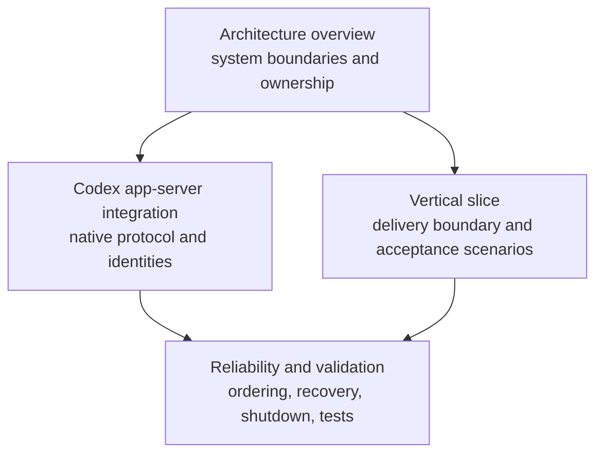
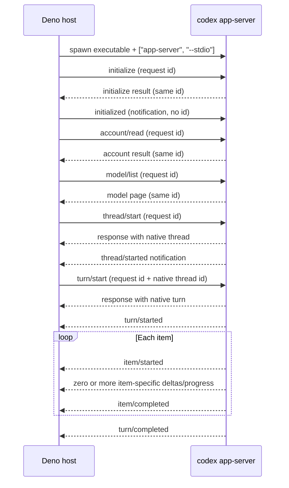

# Research: Current Deno Desktop and Codex app-server protocol-spike evidence

**Date**: 2026-07-23T10:24:00-04:00
**Git Commit**: 54c4895da40bdefe6bf6cf483b0ebc95265435f5
**Branch**: main
**Repository**: vantage

## Research Questions

1. What executable code, runtime configuration, version-pinning files, generated artifacts, test infrastructure, and repository conventions currently exist for this spike, and how do the relevant requirements divide across `docs/architecture/README.md`, `docs/architecture/vertical-slice.md`, `docs/architecture/codex-app-server.md`, and `docs/architecture/reliability.md`? Provide file-and-line evidence, including evidence for material absences.
2. What version-reporting, release, installation, and compatibility information do the current Deno and Codex CLI interfaces expose for identifying an exact Deno 2.9 patch and Codex CLI compatibility pair, and what platform or experimental-runtime constraints apply? Cite primary Deno and OpenAI sources alongside any repository evidence.
3. What commands and output contracts does the pinned Codex CLI expose for generating TypeScript definitions and JSON Schema artifacts, and how do those artifacts identify protocol methods, notifications, payload unions, and version-specific compatibility behavior? Cite the generated-schema interfaces or other primary OpenAI sources and connect them to `docs/architecture/codex-app-server.md`.
4. What is the exact app-server wire sequence and data contract for process startup, `initialize`, `initialized`, `account/read`, `model/list`, `thread/start`, `turn/start`, streamed item or progress output, and `turn/completed`, including request IDs, native thread/turn IDs, stdout-versus-stderr handling, and ordering guarantees? Support the answer with pinned-schema evidence, primary OpenAI documentation, and repository file-and-line references.
5. Which concrete events and payloads can occur during one real authenticated text turn with the pinned CLI, and what evidence is needed to classify them in the initial method/event coverage manifest and prove that a captured transcript is ordered and schema-valid? Distinguish required lifecycle evidence from optional or unknown notifications.
6. How do the relevant Deno subprocess APIs behave for spawning `codex app-server` without a shell, streaming and closing stdio, observing exit status, applying time bounds, and terminating descendant processes on each initially relevant operating system? Cite primary Deno documentation and relate the findings to the shutdown and no-descendant invariants in `docs/architecture/reliability.md`.
7. What observable conditions distinguish missing Deno, missing Codex, an unsupported Codex version, and an unauthenticated Codex profile, and what existing test and diagnostics expectations govern actionable error output, temporary Git repositories, authenticated-test isolation, timing observations, and clean-shutdown verification? Provide file-and-line evidence for local expectations and primary-source evidence for external behavior.

## Research Methodology (verbatim)

This document will remain objective and factual. It does not contain any recommendations or implementation suggestions.
Evidence gaps will not ask why things have not been built or what should be built in the future.

There is no "implementation" section - that is intentional.

Repository inspection covered the complete working tree while pruning `.git/` and `.rpi/`. The only `.rpi/` input read was the supplied research-questions artifact, and the only `.rpi/` output is this research document. Normal-sized architecture documents named by the research questions were read in full before parallel read-only repository, Codex, and Deno research began. External behavior was checked against primary Deno and OpenAI documentation, version-tagged upstream source where public API documentation did not describe an operating-system detail, locally installed CLI help/version output, version-specific generated protocol artifacts, and a bounded observed app-server session. Generated inspection files were not added to the repository.

## Coverage And Gaps

| Area | Evidence inspected | Coverage depth | Remaining gaps |
| --- | --- | --- | --- |
| Repository inventory, conventions, and division of architecture responsibilities | Exhaustive non-`.rpi/` file inventory; `.gitignore`; `README.md`; `docs/README.md`; all four named architecture documents | full | No implementation or test evidence exists to inspect; that material absence is established by the exhaustive inventory. |
| Deno and Codex versions, releases, installation, and compatibility | Local `command -v`/`--version`; Deno 2.9.3 release and installation docs; Codex 0.145.0 release, CLI, and app-server docs | full | The repository records no selected or validated Deno/Codex compatibility pair. |
| Codex TypeScript and JSON Schema generators | Local 0.145.0 help and clean generation; stable and experimental generated unions; official version-specific generator contract | targeted | Generated artifacts are not committed in Vantage, and the locally generated inspection copies are not repository evidence. |
| App-server lifecycle and wire contracts | Version-tagged 0.145.0 app-server documentation, generated protocol unions, Vantage architecture, and one observed 0.145.0 session | full | The observed session retained ordered envelope summaries, not a complete raw unredacted payload transcript that can be replayed through every JSON Schema. |
| Real authenticated text-turn events and coverage classification | One ephemeral authenticated 0.145.0 text turn, stable generated notification union, official item lifecycle reference | targeted | No repository-owned transcript or method/event coverage manifest exists; optional events remain run-, configuration-, model-, account-, and tool-dependent. |
| Deno subprocess and process-tree behavior | Deno API docs, Deno 2.9.3 implementation/tests, Desktop target/backend docs, Vantage reliability contract | full | Primary Deno documentation gives no cross-platform descendant-tree termination guarantee, and Vantage names no initially supported OS set or validated results. |
| Environment diagnostics and testing evidence | Local missing-Deno observation, Deno missing-executable tests, Codex account behavior, exhaustive repository test inventory, documented test strategy | full | Vantage has no implemented version gate, diagnostics, harness, measurements, or tests; unsupported-Codex behavior therefore has no current executable contract. |

## Summary

Vantage is currently an architecture repository rather than an executable application. The exhaustive working-tree inventory outside `.rpi/` contains `.gitignore` and eight Markdown documents, with no source tree, Deno configuration, dependency lockfile, package manifest, exact runtime pin, generated protocol artifact, method/event manifest, transcript, test file, fixture, migration, CI workflow, or packaged output. The four named architecture documents divide responsibility cleanly: the overview owns system boundaries, the vertical slice owns delivery and acceptance behavior, the Codex integration document owns the native protocol boundary, and the reliability document owns ordering, recovery, shutdown, observability, and tests.

Current external interfaces identify Deno 2.9.3 as the latest published 2.9 patch and Codex CLI 0.145.0 as the locally installed and latest stable Codex release at the research timestamp. These two facts do not establish a Vantage compatibility pair. The repository still records the pair as an open spike result and contains neither pin. Deno Desktop remains experimental in the 2.9 line, supports five documented desktop build targets, and varies by system-WebView platform unless CEF is selected.

Codex 0.145.0 generates version-matched TypeScript and JSON Schema bundles. Its stable generated protocol contains 92 client request methods, one client notification (`initialized`), 72 server notifications, 10 server-initiated request methods, and an 18-variant `ThreadItem` union. The app-server transport is bidirectional JSON-RPC-shaped JSONL without the `jsonrpc` field. A real authenticated turn showed that responses and notifications can interleave while each item preserves `item/started` → zero or more deltas → `item/completed`, and the turn terminates with `turn/completed`.

Deno's public subprocess API describes direct executable spawning, independent piped streams, manual stdin closure, exit status, abort, and direct-child signaling. It does not document a portable process-tree termination guarantee. Vantage's no-descendant shutdown invariant and per-platform packaged validation are therefore current architecture requirements without repository implementation or measured evidence.

## Detailed Findings

### 1. The repository is documentation-only

The complete non-`.rpi/`, non-`.git/` inventory has nine files: `.gitignore`, the root `README.md`, two documents directly under `docs/`, and five documents under `docs/architecture/`. Eight files are Markdown. The root README states that the repository is in its architecture and first-vertical-slice design phase (`README.md:3-7`).

No executable or runtime material exists in that bounded tree. Searches over the exhaustive inventory found no TypeScript or JavaScript file; no test- or spec-named file; no `deno.json`, `deno.jsonc`, `deno.lock`, `package.json`, package-manager lockfile, or `tsconfig`; no tool-version file; no JSON, TOML, YAML, or CI workflow; and no generated/schema/coverage-manifest/transcript-named artifact. Because the only non-root directory cluster is `docs/`, the tree also has no source, test, fixture, migration, build-output, or packaged-desktop directory.

The architecture documents describe version and evidence requirements rather than recording completed outputs:

- The accepted desktop decision is a validated but unnamed Deno 2.9 patch, while Codex is selected through `codex app-server` (`docs/architecture/README.md:20-34`).
- The overview requires an exact Deno patch in development and CI and packaged validation of subprocess, stdio, shutdown, SQLite, and WebView behavior (`docs/architecture/README.md:202-214`).
- The Codex boundary requires a pinned CLI, generated TypeScript and JSON Schema, a coverage manifest, compatibility tests, and explicit incompatible-version rejection (`docs/architecture/codex-app-server.md:331-344`).
- The exact Deno/Codex pair and cross-platform descendant cleanup remain listed among the questions the spikes must close (`docs/architecture/reliability.md:356-364`).

The only numeric Deno runtime line in the repository is `2.9`; no patch version or Codex CLI version is recorded.

#### Repository conventions

The documentation index assigns authority by document type. The vertical-slice document is authoritative for current delivery scope, architecture documents are authoritative for technical decisions, and the append-only decision log preserves history (`docs/README.md:8-30`; `docs/architecture/decisions.md:1-4`). The status vocabulary is Direction, Accepted, Provisional, Deferred, and Superseded (`docs/README.md:32-38`).

The `.gitignore` is an exhaustive generated OS-template list for Linux, macOS, and Windows. It contains no Deno, TypeScript, build, test, coverage, SQLite, or desktop-packaging pattern (`.gitignore:1-74`).

#### Testing patterns

There are no implemented tests, test runner, fake server, fixture, test utility, or CI job. Current testing information exists only as architecture requirements. Each component-specific testing pattern is described in the sections below.

### 2. Architecture documents divide the spike into four contracts

The documents compose as a hierarchy rather than duplicating one specification:



`docs/architecture/README.md` owns the system shape: WebView, typed desktop gateway, project registry, Codex catalog/session/process/protocol/projector components, persistence worker, and SQLite (`docs/architecture/README.md:38-78`). It assigns local state, filesystem access, version checks, Codex processes, and the application event sequence to the trusted Deno host; the WebView remains presentation-only (`docs/architecture/README.md:80-115`). Typed bindings carry commands and snapshots into the host, while a same-origin resumable SSE stream carries host events to the UI (`docs/architecture/README.md:117-142`).

`docs/architecture/vertical-slice.md` owns user-visible delivery. It spans the desktop shell, project registration, Codex preflight, model selection, native thread continuity, one active text turn, blocking requests, interruption, persistence, and recovery (`docs/architecture/vertical-slice.md:5-86`). It also defines explicit exclusions (`docs/architecture/vertical-slice.md:88-105`) and seven packaged acceptance scenarios: first conversation, restart/continue, interruption, blocking request, model control, UI reconnect, and unsupported environments (`docs/architecture/vertical-slice.md:138-155`).

`docs/architecture/codex-app-server.md` owns the native boundary. It defines JSONL framing, three message directions, separate stderr, process-host responsibilities, request correlation, schema validation, session identity, event projection, the required method/event families, connection/turn lifecycles, blocking requests, profiles, and schema/version policy (`docs/architecture/codex-app-server.md:43-176`, `docs/architecture/codex-app-server.md:178-344`).

`docs/architecture/reliability.md` owns durable records, ordered ingestion, SSE recovery, native reconciliation, process-exit states, shutdown, bounds, measurements, tests, and phase exit criteria (`docs/architecture/reliability.md:9-339`). It distinguishes native thread identity from UI projection and requires wire-order ingestion, monotonic application sequencing, at-most-once server-request responses, no automatic replay of uncertain turns, and no descendants after shutdown (`docs/architecture/reliability.md:9-22`).

#### Testing patterns

The overview calls for packaged validation of Deno Desktop and Codex process behavior (`docs/architecture/README.md:202-214`). The vertical slice expresses scenario-level packaged E2E acceptance (`docs/architecture/vertical-slice.md:138-169`). The Codex document calls for pinned-schema and compatibility tests (`docs/architecture/codex-app-server.md:203-209`, `docs/architecture/codex-app-server.md:331-344`). The reliability document supplies the detailed deterministic, real-Codex, host-integration, and packaged-E2E test layers (`docs/architecture/reliability.md:251-299`). None has a corresponding repository implementation.

### 3. Current version and installation interfaces identify releases, not a validated pair

#### Deno

As of the research timestamp, [Deno 2.9.3](https://github.com/denoland/deno/releases/tag/v2.9.3) is the latest published 2.9 patch; the published 2.9 sequence is 2.9.0 through 2.9.3. Deno exposes the installed version through `deno --version`, and runtime code can read `Deno.version.deno` ([Deno installation verification](https://docs.deno.com/runtime/getting_started/installation/#testing-your-installation), [`Deno.version`](https://docs.deno.com/api/deno/runtime/#Deno.version)).

Primary interfaces accept exact releases:

| Interface | Exact-version form |
| --- | --- |
| Existing Deno executable | `deno upgrade --version 2.9.3` |
| Official Unix installer | `curl -fsSL https://deno.land/install.sh \| sh -s v2.9.3` |
| Official PowerShell installer | set `$v="2.9.3"` before evaluating `install.ps1` |
| Manual distribution | versioned per-target archive plus matching `.sha256sum` |
| GitHub Actions | `denoland/setup-deno@v2` with exact `deno-version` |

These forms are documented by the [Deno upgrade reference](https://docs.deno.com/runtime/reference/cli/upgrade/#upgrade-to-a-specific-version), [official installer](https://github.com/denoland/deno_install#install-specific-version), [manual installation reference](https://docs.deno.com/runtime/getting_started/installation/#manual-download), and [setup-deno action](https://github.com/denoland/setup-deno#version-from-input).

The current workspace has no `deno` executable on `PATH`; `deno --version` returns shell exit 127 with `command not found`. That is an environment observation, not a repository configuration.

#### Codex

The installed executable reports:

```text
codex-cli 0.145.0
```

It resolves through Homebrew Cask to the arm64 macOS 0.145.0 binary. [Codex 0.145.0](https://github.com/openai/codex/releases/tag/rust-v0.145.0) was the latest stable release at the research timestamp; a newer 0.146.0 alpha prerelease did not replace it as stable. The [official Codex CLI page](https://developers.openai.com/codex/cli) presents the standalone macOS/Linux install/update command and identifies first-run sign-in behavior.

OpenAI explicitly states that app-server generated artifacts are specific to, and match, the Codex version that generated them ([message schema contract](https://developers.openai.com/codex/app-server#message-schema)). Vantage expresses the same version coupling in its schema policy (`docs/architecture/codex-app-server.md:331-344`).

The observed Deno release and local Codex release are not a compatibility result. Vantage contains no exact Deno pin, Codex pin, supported range, real compatibility-test output, or packaged measurement, and its reliability document still treats the pair as unresolved (`docs/architecture/reliability.md:356-364`).

#### Deno Desktop platform and experimental constraints

`deno desktop` first appears in 2.9.0 and is explicitly experimental, with a stabilizing surface and platform features still landing ([Deno 2.9 release](https://deno.com/blog/v2.9#deno-desktop)). Desktop artifacts bundle the application, Deno runtime, and a rendering backend; runtime permissions passed to the Desktop build become compiled behavior ([Desktop CLI](https://docs.deno.com/runtime/reference/cli/desktop/)).

The current [distribution reference](https://docs.deno.com/runtime/desktop/distribution/#per-platform-output) lists five desktop build targets:

- macOS arm64 and x86_64;
- Windows x86_64; and
- Linux arm64 and x86_64.

The default system backend maps to WKWebView on macOS, WebView2 on Windows, and WebKitGTK on Linux; rendering and features vary with the platform and OS version. CEF bundles Chromium and gives a common engine with a larger artifact ([Desktop backends](https://docs.deno.com/runtime/desktop/backends/#available-backends)). Vantage keeps its rendering choice provisional and requires packaged validation (`docs/architecture/README.md:202-218`). It does not currently name an initially supported OS set or primary development platform.

#### Testing patterns

No repository version test or CI matrix exists. The architecture assigns exact version rejection and compatibility testing to real Codex integration tests (`docs/architecture/reliability.md:268-281`) and requires per-platform packaged validation before support is advertised (`docs/architecture/reliability.md:293-299`).

### 4. Codex 0.145.0 generators expose a version-specific protocol surface

The installed CLI exposes:

```text
codex app-server generate-ts --out <DIR>
codex app-server generate-json-schema --out <DIR>
```

`generate-ts` also accepts an optional Prettier executable. Both commands accept `--experimental` and inherited configuration/feature flags. A clean stable generation from 0.145.0 exited zero with no stdout or stderr, writing 617 TypeScript files and 273 JSON Schema files. The schema output includes individual definitions, versioned bundles, and top-level JSON-RPC envelope schemas. This observed contract matches the [official generator documentation](https://developers.openai.com/codex/app-server#message-schema).

The stable generated unions describe:

| Generated union | 0.145.0 stable content |
| --- | --- |
| Client requests | 92 method variants |
| Client notifications | one variant: `initialized` |
| Server notifications | 72 method variants |
| Server requests | 10 method variants |
| Request ID | `string \| number` |
| `ThreadItem` | 18 tagged variants |

The ten server-initiated methods are command approval, file-change approval, structured user input, MCP elicitation, permissions approval, dynamic tool call, auth-token refresh, attestation generation, and two legacy approval methods. The `ThreadItem` union contains `userMessage`, `hookPrompt`, `agentMessage`, `plan`, `reasoning`, `commandExecution`, `fileChange`, `mcpToolCall`, `dynamicToolCall`, `collabAgentToolCall`, `subAgentActivity`, `webSearch`, `imageView`, `sleep`, `imageGeneration`, `enteredReviewMode`, `exitedReviewMode`, and `contextCompaction`.

Stable client requests span initialize, account/model catalog, thread and turn lifecycle, skills/hooks/plugins/apps, MCP, filesystem/commands, configuration, Windows sandbox, and compatibility helpers. Stable server notifications span lifecycle, item deltas and progress, token usage, account/rate limits, model routing, MCP startup, warnings/errors, processes, realtime events, plugins/apps, filesystem, remote control, and import progress.

Representative payload contracts from the generated 0.145.0 surface are:

```ts
type RequestId = string | number;

type InitializeParams = {
  clientInfo: { name: string; title: string; version: string };
  capabilities?: ClientCapabilities | null;
};

type AccountReadResponse = {
  account: Account | null;
  requiresOpenaiAuth: boolean;
};

type ModelListResponse = {
  data: Model[];
  nextCursor: string | null;
};
```

`thread/start` returns a native `thread` plus effective model, provider, cwd, policy, sandbox, and effort information. `turn/start` requires a native `threadId` and input and returns the initial native `turn`. Generated comments describe Codex-created thread and turn IDs as UUIDv7. Item lifecycle notifications carry `threadId`, `turnId`, a full tagged item, and timestamps. `turn/completed` carries a full turn whose terminal status is `completed`, `interrupted`, or `failed`.

With `--experimental`, the observed 0.145.0 output added 37 client methods and one server request (`currentTime/read`) without adding notification method names. Experimental methods cover paginated thread history/search, background terminals, process control, realtime input, environments, remote control, memories, collaboration modes, and fuzzy search. This difference demonstrates that generator flags as well as the binary version determine the generated contract.

The tag-pinned primary source for these semantics is the [0.145.0 app-server reference](https://github.com/openai/codex/blob/rust-v0.145.0/codex-rs/app-server/README.md). Vantage's architecture requires these version-specific artifacts and their coverage classification but contains none today (`docs/architecture/codex-app-server.md:160-176`, `docs/architecture/codex-app-server.md:331-344`).

#### Testing patterns

No generated schema or generator test exists in Vantage. The architecture describes strict validation for methods Vantage invokes, compatibility handling for unknown notifications, generated decision-union tests, and real compatibility tests before a version change (`docs/architecture/codex-app-server.md:73-89`, `docs/architecture/codex-app-server.md:283-300`, `docs/architecture/codex-app-server.md:331-344`).

### 5. The app-server lifecycle is ordered JSONL with interleavable messages

The default app-server transport is stdio. It carries one JSON object per line using JSON-RPC 2.0 message shapes while omitting `"jsonrpc":"2.0"` ([OpenAI protocol reference](https://developers.openai.com/codex/app-server#protocol)). The three directions are:

| Direction | Required envelope members | Correlation |
| --- | --- | --- |
| Client request | `method`, `id`, `params` | server echoes `id` in `result` or `error` response |
| Client notification | `method`, `params` | no `id`, no response |
| Server notification | `method`, `params` | no `id`, no response |
| Server request | `method`, `id`, `params` | client responds using the original connection-local `id` |

Vantage independently specifies stdout as protocol-only and stderr as separately drained diagnostics (`docs/architecture/codex-app-server.md:43-55`). OpenAI's reference documents tracing/log output on stderr. Protocol parsing therefore applies only to stdout.

#### Connection, catalog, thread, and turn sequence



OpenAI requires exactly one `initialize` request per connection, followed by `initialized`; another method before initialization returns `Not initialized`, and repeated initialize returns `Already initialized` ([initialization reference](https://developers.openai.com/codex/app-server#initialization)). The initialize request identifies the client; its result includes `userAgent`, `codexHome`, `platformFamily`, and `platformOs`.

`account/read` accepts an optional `refreshToken` flag and returns `account: Account | null` plus `requiresOpenaiAuth` ([auth endpoint](https://developers.openai.com/codex/app-server#auth-endpoints)). `model/list` is paginated and optionally includes hidden entries; returned models carry native IDs, visibility, reasoning-effort and service-tier information ([API overview](https://developers.openai.com/codex/app-server#api-overview)). Vantage assigns those four calls to its short-lived catalog process (`docs/architecture/codex-app-server.md:91-108`).

`thread/start` establishes the native resume identity. The JSON-RPC request ID is connection-local correlation only and is distinct from the Codex thread ID, Codex turn ID, Vantage IDs, and server-request IDs (`docs/architecture/codex-app-server.md:143-158`). `turn/start` uses the native thread ID and returns a native turn; the stream then uses those native IDs in lifecycle payloads.

The official per-item ordering guarantee is:

```text
item/started
  -> zero or more item-specific deltas or progress notifications
  -> item/completed
```

The turn emits `turn/started` and ends with `turn/completed`; terminal status is `completed`, `interrupted`, or `failed` ([turn events](https://developers.openai.com/codex/app-server#turn-events)). Vantage requires its client to preserve native notification and server-request wire order, serialize stdin writes, and correlate concurrent responses by request ID (`docs/architecture/codex-app-server.md:73-89`; `docs/architecture/reliability.md:96-119`).

The observed 0.145.0 session demonstrates that the sequence diagram is a lifecycle relation, not a promise that every response precedes every related notification. `thread/started` and MCP startup notifications arrived after the client wrote `turn/start` but before the `turn/start` response. Response IDs made this interleaving unambiguous. The authoritative total order for a captured run is the stdout line order.

#### Testing patterns

Vantage has no protocol-client tests. Its deterministic test contract uses a fake child over real stdin/stdout to cover partial JSONL reads, request correlation, serialized writes, notification ordering, server requests, malformed messages, limits, abrupt exit, and unknown notifications (`docs/architecture/reliability.md:251-266`). Assertions are defined in terms of state and messages rather than sleeps or log text.

### 6. A real authenticated 0.145.0 text turn exercised required and optional events

A bounded authenticated session used an ephemeral native thread and a simple text prompt. It did not modify this repository. Request IDs were connection-local integers; native thread and turn IDs were distinct UUIDv7 values; the user item used a UUIDv7 value, while the agent message item used an upstream-style `msg_...` identifier.

The protocol-only stdout order was:

| Order | Direction/event | Material payload evidence |
| ---: | --- | --- |
| 1–3 | `initialize` request, matching response, `initialized` notification | client metadata; result platform and Codex-home fields |
| 4–6 | `account/read`, `remoteControl/status/changed`, matching account response | `account.type: "chatgpt"`; `requiresOpenaiAuth: true` |
| 7–8 | `model/list` and response | seven visible models; a returned default model |
| 9–10 | `thread/start` and response | ephemeral thread UUIDv7; `cliVersion: "0.145.0"` |
| 11–14 | `turn/start` write, `thread/started`, MCP startup updates, matching turn response | turn UUIDv7; `status: "inProgress"` |
| 15–17 | thread active status, `turn/started`, more MCP startup updates | native thread/turn lifecycle |
| 18–19 | user `item/started` then `item/completed` | full `userMessage` item |
| 20–22 | agent `item/started`, five `item/agentMessage/delta`, `item/completed` | empty initial item, ordered deltas, complete final text |
| 23–26 | token usage, rate limits, thread idle, `turn/completed` | completed terminal turn |

Stderr contained plugin/MCP diagnostics during the successful turn. Those lines were not JSONL protocol input. Every stdout line parsed as JSON, and every observed notification method belonged to the stable 0.145.0 generated notification union.

#### Coverage classification

The observed required lifecycle evidence is:

- one initialization request/response pair and the `initialized` notification;
- successful account and model request/response correlation;
- a native thread identity and a native turn identity;
- `turn/started`;
- each observed item's matching start and completion;
- ordered agent-message deltas reconstructing the final item text; and
- `turn/completed` with a terminal status.

Notifications such as remote-control status, MCP startup status, token usage, rate limits, and thread status occurred in this run but are not required for every plain text turn. Plan, reasoning, command, file-change, tool, approval, model-routing, warning, error, and unknown notifications are conditional on model behavior, enabled integrations, account state, policies, capabilities, and CLI version. The generated union establishes that they are known to 0.145.0; an individual run establishes only what occurred in that run.

A schema-valid ordered transcript requires:

1. the exact CLI version and generator flags;
2. the matching generated request, response, notification, and error schemas;
3. raw stdout lines retained with their original order;
4. stderr retained separately;
5. parse success for every stdout line;
6. envelope classification and request-ID correlation;
7. full payload validation against the matching method schema;
8. native thread, turn, and item ID continuity checks;
9. per-item lifecycle ordering checks; and
10. a coverage record classifying each seen method and each generated-but-unseen method.

The bounded run retained ordered summarized envelopes rather than the complete raw unredacted payload stream. It therefore establishes observed method order and union membership, but it is not a replayable full-payload schema-validation artifact. Vantage contains no repository transcript or coverage manifest.

#### Testing patterns

The documented real-Codex test layer uses a pinned CLI, temporary Git repositories, isolated `CODEX_HOME` directories, and explicitly tagged/separate authenticated-network tests (`docs/architecture/reliability.md:268-281`). Phase 0 requires a schema-valid ordered transcript and a clean process exit (`docs/architecture/reliability.md:302-307`). No such repository-owned test or artifact currently exists.

### 7. Deno subprocess APIs cover the direct child, not a portable process tree

`new Deno.Command(command, { args })` accepts an executable and argument array; `spawn()` returns a streamable `Deno.ChildProcess` ([Deno subprocess API](https://docs.deno.com/api/deno/subprocess/#Deno.Command)). This is the direct API shape corresponding to Vantage's argument-array process host (`docs/architecture/README.md:98-115`; `docs/architecture/codex-app-server.md:57-71`).

The usual spawn path starts the named executable directly. One version-specific nuance is that Deno 2.9.3 on Unix retries an `ENOEXEC` executable-format failure through `/bin/sh`; Windows does not use that fallback ([Deno 2.9.3 process source](https://github.com/denoland/deno/blob/v2.9.3/ext/process/lib.rs#L1457-L1485)). This is upstream implementation behavior, while the Vantage command construction itself remains an executable plus argument array.

For `spawn()`, stdin, stdout, and stderr default to inherited. Each must be set to `"piped"` to expose its Web Stream. Piped stdout and stderr are independent readable byte streams. Piped stdin is a writable byte stream and must be closed manually. `Command.output()` and `outputSync()` reject `stdin: "piped"`, so a persistent bidirectional JSONL session uses `spawn()` rather than those collection helpers ([subprocess API](https://docs.deno.com/api/deno/subprocess/#Deno.Command), [spawn example](https://docs.deno.com/examples/subprocesses_spawn/)).

`child.status` is a promise for the direct child's `{ success, code, signal }` result. `child.kill()` sends the direct child `SIGTERM` by default. `CommandOptions.signal` accepts an `AbortSignal`; abort sends the child `SIGTERM`, and `AbortSignal.timeout(ms)` supplies a time-based signal. `Deno.Command` has no numeric timeout option, and abort does not itself guarantee that the child has exited; completion is still observed through `child.status` ([ChildProcess API](https://docs.deno.com/api/deno/subprocess/#Deno.ChildProcess), [signal option](https://docs.deno.com/api/deno/~/Deno.CommandOptions.signal), [AbortSignal](https://docs.deno.com/api/web/platform/#AbortSignal)).

#### Descendants and operating-system behavior

`ChildProcess.kill()` targets the stored positive PID, not a process group. On Unix, `Deno.kill()` accepts a negative PID to signal a process group; negative PIDs throw on Windows ([`Deno.kill`](https://docs.deno.com/api/deno/subprocess/#Deno.kill)).

`CommandOptions.detached` creates a detached session/process group. Deno 2.9.3 uses `setsid()` on Unix and `DETACHED_PROCESS | CREATE_NEW_PROCESS_GROUP` on Windows. Detached children are documented as able to continue after the parent exits, subject to `unref()` and open streams ([detached option](https://docs.deno.com/api/deno/subprocess/#Deno.CommandOptions)).

For non-detached children, the Deno 2.9.3 Unix resource-drop path sends a best-effort signal to the direct PID rather than `-pid` or an enumerated tree ([2.9.3 drop implementation](https://github.com/denoland/deno/blob/v2.9.3/ext/process/lib.rs#L266-L305)). On Windows, Deno uses a global job object with `JOB_OBJECT_LIMIT_KILL_ON_JOB_CLOSE` and attempts to assign non-detached children; assignment can be skipped for a nested-job access-denied case ([Windows implementation](https://github.com/denoland/deno/blob/v2.9.3/runtime/subprocess_windows/src/process.rs#L198-L215), [assignment path](https://github.com/denoland/deno/blob/v2.9.3/runtime/subprocess_windows/src/process.rs#L717-L735)).

Primary Deno API and Desktop documentation do not promise that `kill()`, abort, stdin close, resource drop, window close, or packaged runtime exit terminates every descendant on macOS, Linux, and Windows. They expose no documented cross-platform process-tree abstraction.

Vantage requires a bounded shutdown sequence: stop commands, settle local work, request interruption, close stdin, terminate each process tree, await exit within another bound, force termination when necessary, and close SQLite after projection handling (`docs/architecture/reliability.md:189-203`). The no-descendant invariant is explicit (`docs/architecture/reliability.md:9-22`), but no implementation or per-platform result exists.

#### Testing patterns

The architecture separates fake-child abrupt-exit tests, real-Codex kill/resume/interruption tests, Desktop window-close orchestration tests, packaged platform process-tree tests, and repeated open/close leak tests (`docs/architecture/reliability.md:251-339`). No test source, process-tree fixture, measurement, or packaged result exists.

### 8. Current observable environment states are external behavior plus unimplemented Vantage states

| Condition | Observable current evidence | Vantage implementation state |
| --- | --- | --- |
| Missing Deno in this development shell | `deno --version` produces `command not found` and exit 127; Deno documents this as missing installation or PATH visibility | No repository preflight implementation. A packaged Desktop app bundles Deno, so an external end-user Deno command is not part of the packaged runtime contract. |
| Missing Codex inside a future Deno host | Deno 2.9.3 tests expect `Deno.errors.NotFound` with a `Failed to spawn` message for a missing executable | No repository process host or diagnostic mapping. |
| Unsupported Codex | Requires a Vantage-supported version or range and a comparison with `codex --version`/generated compatibility evidence | No pin, range, gate, rejection behavior, or test exists. |
| Unauthenticated Codex profile | `account/read` returns `account: null` and `requiresOpenaiAuth: true` for an isolated fresh `CODEX_HOME` | Architecture assigns auth preflight to `account/read`; no UI or diagnostic implementation exists. |

The [Deno installation guide](https://docs.deno.com/runtime/getting_started/installation/#if-you-see-command-not-found) documents the shell-level missing-Deno condition. A packaged Desktop artifact contains the runtime ([Desktop overview](https://docs.deno.com/runtime/desktop/)). For a missing child executable inside Deno, the version-tagged Deno command tests establish the thrown NotFound form ([Deno 2.9.3 command tests](https://github.com/denoland/deno/blob/v2.9.3/tests/unit/command_test.ts#L590-L602)).

In a bounded unauthenticated 0.145.0 observation using a fresh isolated `CODEX_HOME`, initialize and `account/read` succeeded, with `account: null` and `requiresOpenaiAuth: true`. `thread/start` and `turn/start` were accepted, after which structured error notifications reported retryable HTTP 401 stream-disconnect information. Stderr separately carried unauthorized/retry/fallback diagnostics. No `turn/completed` occurred during the observation window because retry behavior was ongoing. This shows that unauthenticated state is directly available from account preflight and that a turn request need not fail synchronously.

The architecture requires actionable unsupported-environment states (`docs/architecture/vertical-slice.md:138-155`), records profile executable path, `CODEX_HOME`, environment overrides, and supported-version metadata (`docs/architecture/codex-app-server.md:312-329`), and classifies unsupported version, authentication required, malformed protocol, and inaccessible cwd as recovery failures (`docs/architecture/reliability.md:168-181`).

Required diagnostic context includes Vantage and native IDs, profile and Codex version, Deno/backend version, PID, protocol method/request ID, state transition, queue depth, and latency (`docs/architecture/reliability.md:222-249`). Required measurements cover startup, initialization, thread start/resume, first event, completion, approvals, process exits, reconciliation, decode failures, queues, reconnects, and leaked processes (`docs/architecture/reliability.md:235-246`). None is implemented or measured.

#### Testing patterns

The real-Codex layer calls for a pinned CLI, temporary Git repositories, isolated `CODEX_HOME`, version behavior, and separate tagging of authenticated network tests (`docs/architecture/reliability.md:268-281`). The packaged acceptance layer includes missing Codex, unsupported CLI, unauthenticated account, missing repository, and unavailable native thread (`docs/architecture/vertical-slice.md:138-155`). Current repository evidence contains only these expectations.

## Code References

The researched Vantage area contains no code. The list below is exhaustive for the complete non-`.rpi/` repository tree at the research timestamp.

### Repository entry points and conventions

- `.gitignore:1-74` — Exhaustive current ignore rules; OS-generated patterns only.
- `README.md:3-17` — Repository phase and top-level documentation index.
- `docs/README.md:8-38` — Document ownership, change authority, and status vocabulary.
- `docs/FOUNDATION.md` — Product-foundation document; contextual direction rather than the current spike's technical contract.
- `docs/architecture/decisions.md:1-16` — Append-only decision-log convention and Deno Desktop decision record.

### Architecture overview

- `docs/architecture/README.md:3-36` — Current boundary and decision table.
- `docs/architecture/README.md:38-78` — System component graph.
- `docs/architecture/README.md:83-156` — Runtime boundaries, transports, and state ownership.
- `docs/architecture/README.md:158-200` — Main flow and persistence shape.
- `docs/architecture/README.md:202-231` — Deno Desktop constraints and module seams.

### Delivery boundary

- `docs/architecture/vertical-slice.md:5-86` — Outcome, user journey, and in-scope behavior.
- `docs/architecture/vertical-slice.md:88-136` — Exclusions and interaction contracts.
- `docs/architecture/vertical-slice.md:138-183` — Packaged acceptance, build order, and expected evidence.

### Codex native boundary

- `docs/architecture/codex-app-server.md:43-89` — Wire protocol, process host, and typed client.
- `docs/architecture/codex-app-server.md:91-141` — Catalog, session, and projector responsibilities.
- `docs/architecture/codex-app-server.md:143-209` — Identities, method coverage, and initialization.
- `docs/architecture/codex-app-server.md:211-285` — Turn and blocking-request lifecycles.
- `docs/architecture/codex-app-server.md:287-344` — Runtime policy, profiles, and version/schema policy.

### Reliability and testing

- `docs/architecture/reliability.md:9-119` — Invariants, durable records, ordered ingestion, and backpressure.
- `docs/architecture/reliability.md:121-203` — Snapshot recovery, reconciliation, process exit, and shutdown.
- `docs/architecture/reliability.md:205-249` — Bounds, diagnostic fields, and measurements.
- `docs/architecture/reliability.md:251-299` — Four test layers.
- `docs/architecture/reliability.md:300-364` — Validation phases, gates, and unresolved spike evidence.

### Primary external sources

- [Deno 2.9.3 release](https://github.com/denoland/deno/releases/tag/v2.9.3) — Exact current 2.9 patch release.
- [Deno Desktop 2.9 announcement](https://deno.com/blog/v2.9#deno-desktop) — Experimental status and Desktop introduction.
- [Deno Desktop distribution](https://docs.deno.com/runtime/desktop/distribution/#per-platform-output) — Current target matrix.
- [Deno subprocess API](https://docs.deno.com/api/deno/subprocess/) — Command, child, stdio, status, and signal contracts.
- [Codex 0.145.0 release](https://github.com/openai/codex/releases/tag/rust-v0.145.0) — Installed stable release provenance.
- [Codex app-server reference](https://developers.openai.com/codex/app-server) — Current official protocol reference.
- [Codex 0.145.0 app-server reference](https://github.com/openai/codex/blob/rust-v0.145.0/codex-rs/app-server/README.md) — Version-tagged lifecycle and payload documentation.

## Architecture Documentation

Vantage's current architecture keeps the WebView unprivileged and Codex-specific. The Deno host owns process execution, local state, filesystem authorization, native identities, and event projection. The UI receives typed command/snapshot calls and application-sequenced SSE events rather than raw Codex messages (`docs/architecture/README.md:80-142`).

The native process is disposable while the Codex thread ID is durable. A live app-server belongs to one Vantage thread; the session manager serializes lifecycle transitions and permits one active turn. JSON-RPC request IDs remain connection-local, server-request IDs remain connection-owned, and neither replaces application or native thread/turn identity (`docs/architecture/codex-app-server.md:110-158`).

The ingestion design decouples continuous stdout reading from durable projection. A bounded queue receives parsed messages in wire order; one consumer updates session state, awaits persistence through a dedicated SQLite worker, assigns an application sequence, and publishes to UI subscribers (`docs/architecture/reliability.md:96-119`). Raw provider payloads are diagnostic evidence rather than the public application model (`docs/architecture/codex-app-server.md:125-141`).

Recovery resumes by native thread ID and reconciles against native data; it does not rebuild a conversation from projected messages or replay an uncertain prompt (`docs/architecture/reliability.md:136-181`). Shutdown separately treats graceful interruption, stdin closure, direct/process-tree termination, bounded waits, forced termination, and persistence flush (`docs/architecture/reliability.md:189-203`).

## Evidence Gaps

Six factual gap categories remain:

1. **Validated version pair** — The repository has no selected Deno 2.9 patch, Codex CLI pin/range, compatibility-test output, or packaged validation establishing a pair.
2. **Repository protocol artifacts** — No generated TypeScript, JSON Schema, generator metadata, or method/event coverage manifest is committed.
3. **Replayable transcript proof** — No repository-owned raw ordered transcript exists, and the bounded observed session did not retain every full unredacted payload for replay against the generated schemas.
4. **Cross-platform process-tree proof** — Deno's public API does not guarantee descendant cleanup across macOS, Linux, and Windows; Vantage has no selected initial OS set, packaged tests, or measurements.
5. **Executable diagnostics and test infrastructure** — No source, process host, version gate, error mapper, fake server, temporary-repository fixture, isolated authenticated-test runner, timing collector, leak checker, or CI job exists.
6. **Unsupported-Codex behavior** — Without a Vantage version policy or implementation, no concrete unsupported-version error shape or state transition can be observed.

