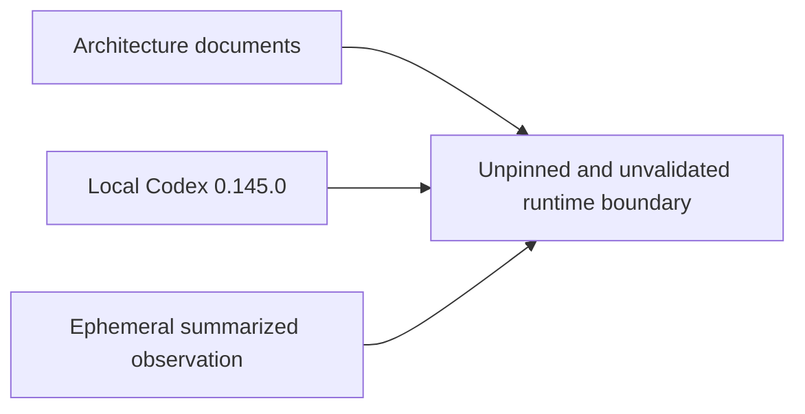
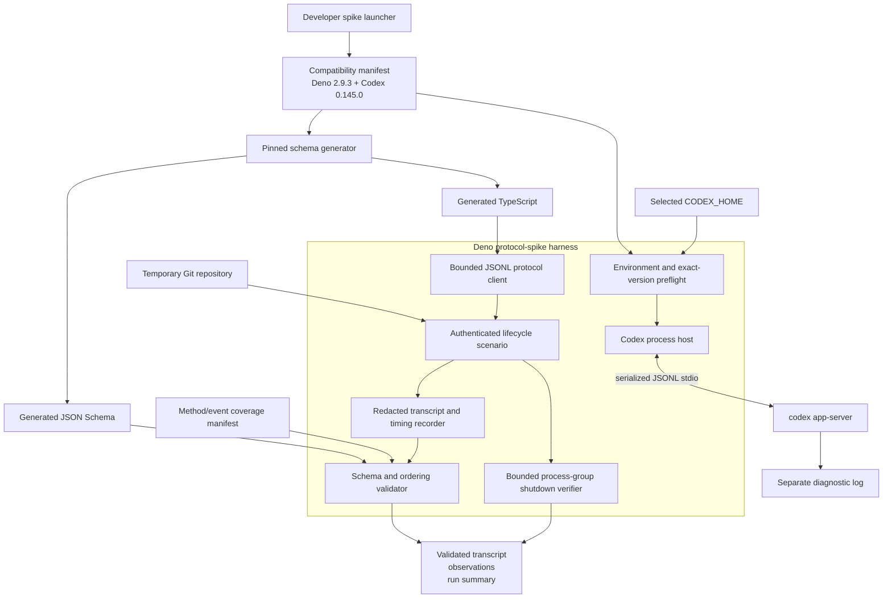

# Design Discussion: Pinned Deno and Codex app-server compatibility spike

### Summary of change request

Create the first executable proof for Vantage's two experimental runtime boundaries. The spike will pin Deno 2.9.3 and Codex CLI 0.145.0, generate and retain the stable app-server TypeScript and JSON Schema contracts from that exact Codex binary, and use a Deno CLI harness to complete one real authenticated streamed turn in a temporary Git repository. The retained evidence must prove ordered, schema-valid protocol handling, actionable preflight failures, measured lifecycle timings, and bounded shutdown with no remaining app-server descendants on the primary validation platform.

This work turns the repository's documented Phase 0 contract into a reproducible compatibility gate. It does not build the Deno Desktop product shell or any user-facing conversation UI.

### Current State

- Vantage is documentation-only. There is no runtime configuration, source tree, generated protocol contract, test runner, CI workflow, compatibility manifest, transcript, or packaged application.
- Deno Desktop 2.9 is an accepted but experimental runtime direction; the repository does not identify a patch release.
- Codex app-server is the accepted provider boundary; the repository does not pin a CLI release or retain generated definitions.
- The current development shell has Codex CLI 0.145.0 but no Deno executable on `PATH`.
- An ephemeral authenticated Codex 0.145.0 observation completed successfully, but its full raw payloads were not retained, so it cannot satisfy the replayable transcript acceptance criterion.
- Deno's documented subprocess API controls a direct child and does not promise portable descendant-tree cleanup.
- Required behavior exists only as architecture contracts: strict stdout/stderr separation, ordered JSONL processing, native request and lifecycle identity, exact version compatibility, and bounded shutdown.
- There is no product behavior or UX to preserve. The immediate pain point is that downstream UI work would otherwise depend on two unproven runtime boundaries.

### Desired End State

- A machine-readable compatibility manifest names Deno 2.9.3, Codex CLI 0.145.0, stable generator mode, the initial platform scope, and the artifact-generation commands.
- The repository retains the TypeScript definitions and JSON Schema bundle generated by Codex CLI 0.145.0 without `--experimental`.
- An initial coverage manifest classifies every generated method and notification as exercised, schema-validated but unexercised, intentionally ignored, or unsupported by this spike.
- A Deno CLI harness launches `codex app-server` directly with argument arrays, keeps stdout protocol-only, drains stderr independently, and correlates interleaved responses by request ID.
- The harness completes `initialize`, `initialized`, `account/read`, `model/list`, `thread/start`, `turn/start`, streamed item output, and `turn/completed` in a temporary Git repository.
- The harness retains an ordered, redacted JSONL transcript whose envelopes and full retained payloads validate against the pinned schemas.
- The transcript proves native thread, turn, and item continuity and each item's `started` → delta/progress → `completed` lifecycle.
- The run records spawn-to-initialize, initialize-to-ready, turn-start-to-first-event, turn-start-to-completion, stdin-close-to-exit, and total shutdown observations.
- Missing developer Deno, missing Codex, exact-version mismatch, and unauthenticated Codex produce distinct actionable diagnostics and non-zero exits before an authenticated turn is attempted.
- Graceful and forced shutdown paths are bounded, idempotent, and verified to leave no app-server descendant on macOS arm64, the initial validation platform.
- Deterministic local tests cover framing, response correlation, ordering, schema rejection, diagnostic states, timeouts, and shutdown without requiring an authenticated network account.
- A separate explicitly tagged real-Codex test owns the authenticated acceptance run.

### What we're not doing

- Building the Deno Desktop window, WebView, typed desktop gateway, local SSE stream, SQLite persistence, or product UI.
- Implementing Vantage projects, durable threads, thread resume/reconciliation, approvals, interruption UX, or general conversation projection.
- Advertising Windows, Linux, or macOS x86_64 support. Those platforms remain unvalidated until their packaged process-tree, WebView, path, and packaging checks pass.
- Promising that Deno's direct-child APIs provide portable descendant cleanup. The spike will implement and measure an explicit macOS arm64 strategy.
- Supporting a Codex version range. Compatibility is exact-match until evidence justifies widening it.
- Enabling `--experimental` app-server generators or experimental capabilities.
- Requiring optional notifications such as MCP startup, rate limits, token usage, plan, command, approval, or tool events to occur in the acceptance turn.
- Rendering all 92 generated client methods, 72 server notifications, 10 server requests, or 18 `ThreadItem` variants.
- Treating stderr as protocol input or retaining secrets, authentication material, prompt contents, or direct personal data in committed evidence.
- Reconstructing the prior ephemeral authenticated observation; a new reproducible run must produce the acceptance evidence.

### Proposed End State Architecture

Before:



After:



The implementation should be a narrow, replaceable spike package rather than the first version of the full desktop host. A representative shape is:

```text
deno.json
scripts/
  run-protocol-spike
spikes/codex-app-server/
  compatibility.json
  coverage.json
  generated/0.145.0/
    types/
    json-schema/
  src/
    preflight.ts
    process_host.ts
    jsonl_client.ts
    protocol_validation.ts
    transcript.ts
    lifecycle_scenario.ts
    shutdown.ts
    main.ts
  tests/
    fixtures/fake_app_server.ts
    jsonl_client_test.ts
    protocol_validation_test.ts
    preflight_test.ts
    shutdown_test.ts
    authenticated_turn_test.ts
  evidence/
    authenticated-turn.redacted.jsonl
    authenticated-turn.summary.json
```

`scripts/run-protocol-spike` is a developer bootstrap boundary only. It detects that Deno is absent before a Deno program can run and prints the exact required version and installation guidance. It must then `exec` the Deno task without constructing the Codex command. The Deno process host is the only component that launches Codex, and it always uses `Deno.Command` with an executable plus argument array.

The core scenario is:

```ts
async function runCompatibilityScenario(config: Compatibility): Promise<RunEvidence> {
  assertDenoVersion(config.deno);
  const codex = await resolveAndAssertCodexVersion(config.codex);
  const repo = await createTemporaryGitRepository();

  await using session = await AppServerSession.spawn({
    executable: codex,
    args: ["app-server", "--stdio"],
    cwd: repo.path,
    env: selectedCodexEnvironment(),
  });

  const initialized = await session.initializeOnce(clientInfo);
  const account = await session.request("account/read", { refreshToken: false });
  assertAuthenticated(account);
  const models = await session.requestAllPages("model/list", {});
  const thread = await session.request("thread/start", selectedThreadParams(repo, models));
  const turn = await session.request("turn/start", selectedTurnParams(thread));

  await session.waitForTerminalTurn(turn.id);
  return await session.closeAndValidateEvidence();
}
```

The protocol reader and evidence pipeline remain independent:

```ts
for await (const line of readBoundedLines(child.stdout, limits.maxLineBytes)) {
  const wireIndex = transcript.nextWireIndex();
  const envelope = parseJsonObject(line);
  const classified = correlateOrClassify(envelope, pendingRequests);
  validateKnownPayload(classified, pinnedSchemas);
  transcript.record(redact(classified), wireIndex, monotonicNow());
  orderedEvents.enqueue(classified);
}
```

The committed transcript is a sanitized derivative of the raw in-memory capture. The validator must validate the original decoded payload before redaction, then validate the redacted committed envelope against a separate evidence schema so redaction cannot accidentally produce misleading evidence. The run summary records hashes of the compatibility manifest, coverage manifest, generated schema bundle, and redacted transcript to bind the evidence to the selected pair.

### Design Decisions

#### Pin Deno 2.9.3 and Codex CLI 0.145.0 in stable generator mode

- Option A: Select Deno 2.9.3 and Codex CLI 0.145.0, generate stable artifacts, and require exact runtime equality.
  - Pros: both are exact stable releases identified by the authoritative research; Codex 0.145.0 is locally installed; its generated surface and a successful authenticated observation are already characterized.
  - Cons: the pair has not yet passed the repository-owned Deno harness or descendant-cleanup test.
- Option B: Select the newest releases at implementation time.
  - Pros: begins from newer fixes.
  - Cons: makes this design and its researched protocol counts stale, introduces an unresearched compatibility pair, and prevents reproducible evidence.
- Option C: Support a semver range immediately.
  - Pros: fewer local version mismatches.
  - Cons: no compatibility matrix exists to justify a range, and generated artifacts are version-specific.

Agent-selected for this run: Option A.

Deno 2.9.3 is the latest researched 2.9 patch and Codex 0.145.0 is the researched stable CLI with known generator output. The pair is selected as the spike baseline, not declared compatible until all acceptance gates pass. Stable generation without `--experimental` follows the existing requirement that experimental capabilities be enabled only for a named product need, a pinned-schema test, and a coverage-manifest entry (`docs/architecture/codex-app-server.md:203-209`).

Options B and C are not chosen because they replace evidence with version drift. A future pin change or supported range requires regenerated artifacts and a passing compatibility run.

#### Use one machine-readable compatibility manifest as the source of truth

- Option A: Store the pair, generator flags, expected generated-artifact hashes, initial platform, and validation policy in `spikes/codex-app-server/compatibility.json`; make generation, preflight, and tests read it.
  - Pros: one reviewable source drives every gate; it does not require adopting a repository-wide version manager during a spike.
  - Cons: external installers and CI must explicitly consume the manifest.
- Option B: Record versions only in prose.
  - Pros: minimal setup.
  - Cons: cannot enforce equality or bind evidence to a pair.
- Option C: use only a developer-specific tool-version file.
  - Pros: may automate local installation for one tool manager.
  - Cons: does not pin Codex generator mode, protocol artifacts, platform scope, or evidence hashes and imposes an otherwise unselected tool.

Agent-selected for this run: Option A.

The repository has no package or toolchain convention to inherit. A spike-local JSON manifest is therefore the smallest enforceable contract. `deno.json` provides tasks, but it is not the authoritative runtime-version record. The launcher and Deno preflight both report expected and observed versions from the same manifest.

Stress-tested: embedding mutable candidate/validated status and the coverage hash makes the manifest self-invalidating when the evidence summary hashes it — revised: the manifest contains immutable run inputs, while validation status and the run-specific coverage hash are derived from the matching evidence summary.

#### Commit generated protocol artifacts and classify the entire stable surface

- Option A: Commit the unmodified TypeScript and JSON Schema outputs under a directory named for Codex 0.145.0, plus generation metadata and a complete coverage manifest.
  - Pros: downstream code and validation use exactly the inspected contract; diffs expose protocol changes; generation is reproducible.
  - Cons: adds a large generated tree.
- Option B: Generate artifacts only during tests.
  - Pros: smaller repository.
  - Cons: tests depend on the local binary and cannot review or bind code to a committed contract.
- Option C: hand-write schemas only for methods exercised by the spike.
  - Pros: small initial surface.
  - Cons: drifts from the pinned binary and cannot truthfully classify unknown or unexercised generated members.

Agent-selected for this run: Option A.

The existing schema policy explicitly requires generated TypeScript, JSON Schema, and a method/event coverage manifest (`docs/architecture/codex-app-server.md:331-344`). Generation metadata will record the exact CLI version, command, absence of `--experimental`, file count, and deterministic bundle hash. The coverage manifest distinguishes “exercised in acceptance run” from “present in pinned schema”; optional events are not promoted to acceptance requirements merely because they appeared once.

Stress-tested: an inbound-only transcript cannot prove client-request/client-notification coverage, and the generated schemas are draft-07 with nonstandard numeric formats — revised: retain a schema-valid bidirectional protocol journal and compile every pinned schema with an explicitly configured draft-07 validator and registered Codex formats.

#### Separate process ownership, framing/correlation, scenario control, and evidence validation

- Option A: Implement small modules for preflight, process host, JSONL client, lifecycle scenario, transcript validation, and shutdown.
  - Pros: follows the repository's documented process-host and typed-client seams; enables fake-child deterministic tests; keeps OS behavior out of protocol state.
  - Cons: more files than a single spike script.
- Option B: write one procedural script.
  - Pros: fastest initial draft.
  - Cons: couples cleanup, parsing, network flow, schema checks, and evidence recording, making failure-path tests unreliable.
- Option C: begin the full Vantage catalog/session/projector architecture.
  - Pros: some code could survive into the product.
  - Cons: expands the spike into unrequested product implementation before its runtime boundaries are proven.

Agent-selected for this run: Option A.

The documented architecture already separates OS process behavior from JSONL framing and correlation (`docs/architecture/codex-app-server.md:57-89`) and identifies these as useful seams rather than provider abstractions (`docs/architecture/README.md:220-231`). The spike modules should implement those narrow contracts without introducing a generic provider registry or UI event model.

#### Treat stdout line order as the transcript's total order

- Option A: assign a monotonically increasing `wireIndex` when each complete stdout line is decoded; correlate responses by ID and enforce per-item lifecycle invariants separately.
  - Pros: matches observed response/notification interleaving and the JSONL transport; preserves the only authoritative total order.
  - Cons: a line index alone does not prove semantic lifecycle validity.
- Option B: reorder messages into an expected request-first sequence.
  - Pros: produces a simpler-looking transcript.
  - Cons: falsifies actual wire behavior because notifications can precede related responses.
- Option C: use timestamps as order.
  - Pros: convenient for performance analysis.
  - Cons: timer granularity and asynchronous recording can be ambiguous.

Agent-selected for this run: Option A.

Each stdout line receives `wireIndex`, monotonic timestamp, envelope direction/classification, request correlation, native IDs, validation result, and redacted payload. Validation then checks initialization uniqueness, matching responses, thread/turn continuity, item lifecycle order, delta reconstruction, and terminal `turn/completed`. Stderr is captured separately and never receives a protocol `wireIndex`.

Stress-tested: write-before-registration can lose a fast response, post-validation indexing can omit an invalid frame, and an unnamed queue bound is not enforceable — revised: register correlation before writing with rollback on write failure, assign inbound `wireIndex` at complete-frame extraction, journal both directions under a host observation index, and bind queue count/bytes to tested manifest limits.

#### Validate macOS arm64 process-group cleanup as the initial platform contract

- Option A: make macOS arm64 the initial platform, spawn the app-server in its own process group/session, perform bounded graceful stdin closure, escalate to group `SIGTERM` and then `SIGKILL`, await direct-child status, and use a test-only process-tree probe to prove no recorded descendant remains.
  - Pros: supplies an explicit strategy for the current arm64 macOS development environment and tests the no-descendant invariant rather than assuming it.
  - Cons: does not establish Windows or Linux behavior; descendants that deliberately create a new session require detection beyond group signaling.
- Option B: call `child.kill()` and assume descendants exit.
  - Pros: simple and portable-looking.
  - Cons: Deno documents direct-child behavior only and does not guarantee the required invariant.
- Option C: design a cross-platform process-tree abstraction before running the first spike.
  - Pros: could eventually support every target.
  - Cons: operating-system behavior is not yet measured, and Windows job semantics differ from Unix process groups.

Agent-selected for this run: Option A.

The initial claim is deliberately narrow: a passing run may prove cleanup only on macOS arm64. The session records the direct PID, discovered descendants, shutdown phase, signal escalation, exit status, elapsed time, and post-shutdown process-tree result. Close is idempotent and runs on success, preflight-after-spawn failure, timeout, schema failure, and test cancellation. Other platforms remain unsupported until they pass equivalent packaged validation, consistent with `docs/architecture/reliability.md:293-298`.

Stress-tested: a descendant can create a new session and be reparented before snapshot polling discovers it — unresolvable: polling proves only that no observed descendant remains, so the absolute acceptance gate defaults to failed until implementation evidence supplies race-closing containment or event-based tracking.

#### Make authenticated evidence an explicit, isolated acceptance test

- Option A: keep deterministic tests offline with a fake app-server and run the real authenticated turn only under an explicit tag/permission with an existing selected `CODEX_HOME`.
  - Pros: local and CI failure-path coverage is repeatable; credentials are not copied; network variability cannot masquerade as a parser regression.
  - Cons: the acceptance gate requires an authorized environment and cannot run anonymously.
- Option B: make every test use the real authenticated CLI.
  - Pros: maximizes live integration coverage.
  - Cons: slow, non-deterministic, credential-dependent, and unsuitable for malformed-wire tests.
- Option C: accept only the fake-child tests.
  - Pros: deterministic and easy to automate.
  - Cons: cannot prove the ticket's real authenticated turn criterion.

Agent-selected for this run: Option A.

This follows the existing test strategy: fake child over real stdin/stdout for deterministic protocol behavior, and a separately tagged pinned-CLI test in a temporary Git repository for real Codex behavior (`docs/architecture/reliability.md:251-281`). The authenticated test refuses to start a turn when `account/read` returns `account: null`; it never attempts to bootstrap or copy credentials.

Stress-tested: a schema-valid omitted or repeated `model/list` cursor can otherwise hang catalog discovery — revised: null or absent cursors terminate pagination, repeated cursors fail, and manifest page/deadline bounds cover the catalog loop.

#### Use stable diagnostic codes with actionable observed/expected context

- Option A: return structured diagnostic codes and concise messages for `DENO_NOT_FOUND`, `DENO_VERSION_MISMATCH`, `CODEX_NOT_FOUND`, `CODEX_VERSION_MISMATCH`, `CODEX_AUTH_REQUIRED`, protocol/schema failures, timeout, and leaked descendants.
  - Pros: deterministic tests can assert codes and fields; humans receive a concrete recovery action.
  - Cons: requires a small error model in a spike.
- Option B: expose raw shell, Deno, or Codex error text.
  - Pros: minimal mapping.
  - Cons: unstable across platforms and rarely explains expected versions or recovery.
- Option C: collapse all preflight problems into “unsupported environment.”
  - Pros: one error path.
  - Cons: does not meet the actionable-error criterion.

Agent-selected for this run: Option A.

Every diagnostic includes the failing stage, stable code, expected and observed version/state when applicable, platform, executable path if resolved, and next action. Raw stderr remains bounded supporting evidence, not the primary contract. Missing Deno is a developer-launcher failure because packaged Deno Desktop will bundle the runtime; the other preflight states are owned by the Deno harness.

### Evidence Gaps

- The selected Deno 2.9.3 and Codex CLI 0.145.0 pair has not yet completed the repository-owned harness, so compatibility remains unproven until this spike passes.
- No replayable full-payload authenticated transcript currently exists; the prior observation cannot be reconstructed and must not be used as acceptance evidence.
- macOS arm64 descendant cleanup has not been measured with the proposed process-group and process-tree verification strategy.
- Assumption: a Codex descendant could escape the owned process group before polling discovers it; by default, `noDescendantsRemain` is false and the pair remains unvalidated until a race-closing macOS containment or event-tracking mechanism is demonstrated.
- Empirical startup, first-event, completion, and shutdown values are unknown. This design selects which measurements to record but does not invent pass thresholds beyond bounded test-level timeouts.
- The exact optional notifications in the acceptance run cannot be known in advance because they depend on live account, model, integration, and service behavior. They are evidence to record, not required lifecycle events.

### Patterns to follow

These show the patterns found in the existing codebase that will be followed to implement the proposed end state architecture. The repository contains architecture documentation rather than executable code, so the first snippets are existing documented contracts and the second snippets show their proposed executable form.

#### Keep Codex process ownership behind the trusted Deno host

The architecture assigns executable discovery, version checks, child lifecycle, and JSONL protocol handling to the Deno host while keeping process and protocol responsibilities separate (`docs/architecture/README.md:98-115`; `docs/architecture/codex-app-server.md:57-89`).

```text
Deno host
  -> Codex process host
     -> typed protocol client
        <-> JSON-RPC / JSONL over stdio
           <-> codex app-server child process
```

```ts
const child = new Deno.Command(codexPath, {
  args: ["app-server", "--stdio"],
  cwd: temporaryRepository,
  env: explicitEnvironment,
  stdin: "piped",
  stdout: "piped",
  stderr: "piped",
  detached: true,
}).spawn();

const client = new JsonlClient({
  stdin: child.stdin,
  stdout: child.stdout,
  schemas: pinnedSchemas,
});
const diagnostics = drainStderrSeparately(child.stderr);
```

#### Initialize exactly once before catalog or conversation requests

The documented short-lived catalog order is explicit and the connection contract rejects repeated or late initialization (`docs/architecture/codex-app-server.md:91-105`; `docs/architecture/codex-app-server.md:203-205`).

```text
initialize
initialized
account/read
model/list
```

```ts
await client.request("initialize", { clientInfo });
await client.notify("initialized", {});

const account = await client.request("account/read", { refreshToken: false });
assertAuthenticated(account);
const models = await readEveryModelPage(client);
```

#### Preserve wire order while correlating interleaved responses

The protocol client contract requires one serialized stdin writer, connection-local request IDs, bounded stdout lines, response correlation, and wire-order notification handling (`docs/architecture/codex-app-server.md:73-89`; `docs/architecture/reliability.md:96-119`).

```text
write side: one serialized JSONL writer
read side: bounded complete stdout lines in arrival order
response: correlate by connection-local request ID
notification/server request: preserve stdout wire order
stderr: drain independently and never parse as JSONL
```

```ts
pending.set(id, responsePromise);
try {
  await writer.enqueue(encodeLine({ method, id, params }));
} catch (error) {
  pending.delete(id);
  throw error;
}

for await (const line of boundedLines(stdout)) {
  const index = nextWireIndex();
  const message = decodeAndValidate(line);
  transcript.append(index, message);
  routeWithoutReordering(message, pending, handlers);
}
```

#### Use fake-child tests for deterministic protocol behavior and isolate live auth

The test strategy separates fake-child protocol tests from real pinned-Codex tests and explicitly tags authenticated network tests (`docs/architecture/reliability.md:251-281`).

```text
deterministic:
  fake child + real stdin/stdout
  partial JSONL, correlation, ordering, malformed messages, limits, exit

authenticated:
  pinned CLI + temporary Git repository + selected CODEX_HOME
  initialize, catalog, one streamed turn, completion, shutdown
```

```ts
Deno.test("correlates interleaved responses without reordering notifications", async () => {
  await withFakeAppServer(interleavedFixture, assertOrderedTranscript);
});

Deno.test({
  name: "authenticated pinned Codex turn produces accepted evidence",
  permissions: authenticatedSpikePermissions,
  ignore: Deno.env.get("VANTAGE_RUN_AUTHENTICATED_SPIKE") !== "1",
  fn: runCompatibilityAcceptance,
});
```

#### Make shutdown bounded, observable, and idempotent

The reliability contract stops new work, settles pending operations, interrupts active work, closes stdin, terminates the process tree, waits within bounds, escalates, and only then reports completion (`docs/architecture/reliability.md:189-203`).

```text
stop commands
  -> settle/expire pending work
  -> interrupt active turn within grace bound
  -> close stdin
  -> wait for exit
  -> terminate process group
  -> force terminate if required
  -> verify no descendants
```

```ts
async function close(): Promise<ShutdownEvidence> {
  if (closePromise) return closePromise;
  closePromise = performBoundedShutdown({
    interruptTurn,
    closeStdin,
    childStatus,
    terminateProcessGroup,
    forceProcessGroup,
    verifyNoRecordedDescendants,
  });
  return closePromise;
}
```
