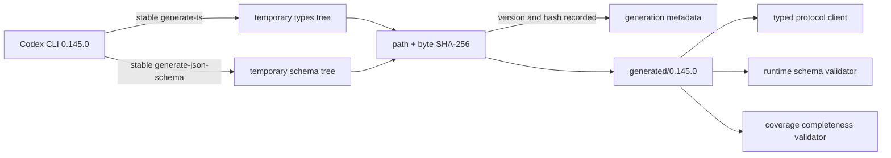
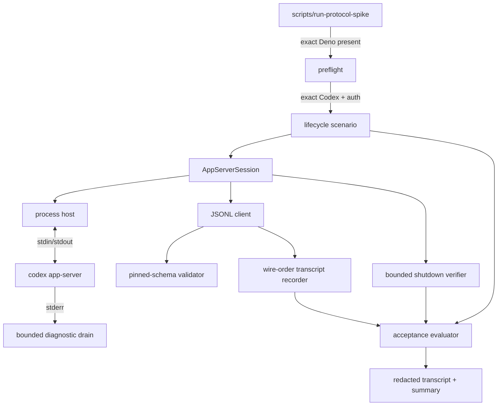
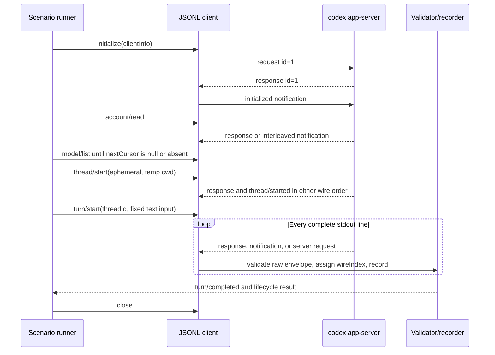

# TDD: Pinned Deno and Codex app-server compatibility spike

### System Design

#### One compatibility manifest binds every executable check and retained artifact

Today the repository records runtime requirements only in prose. The spike adds one
machine-readable compatibility record and makes every generator, preflight, test, and
evidence command consume it. Deno 2.9.3 and Codex CLI 0.145.0 are the selected
baseline; the manifest describes a candidate pair until the authenticated acceptance
run and shutdown proof pass.

```text
loadCompatibility()
  -> validate manifest shape
  -> assert Deno.version.deno === "2.9.3"
  -> resolve codex and assert `codex --version` === "codex-cli 0.145.0"
  -> verify generated artifact bundle hash
  -> verify generated stable-surface membership
  -> allow protocol scenario to start
```

The committed `spikes/codex-app-server/compatibility.json` has this boundary:

```ts
type CompatibilityManifest = {
  schemaVersion: 1;
  deno: {
    version: "2.9.3";
  };
  codex: {
    cliVersion: "0.145.0";
    versionOutput: "codex-cli 0.145.0";
    appServerArgs: ["app-server", "--stdio"];
  };
  generation: {
    mode: "stable";
    typesCommand: ["app-server", "generate-ts", "--out", string];
    jsonSchemaCommand: [
      "app-server",
      "generate-json-schema",
      "--out",
      string,
    ];
    generatedRoot: "spikes/codex-app-server/generated/0.145.0";
    bundleSha256: string;
  };
  validationPlatform: {
    os: "darwin";
    arch: "aarch64";
    cleanupStrategy: "unix-process-group-v1";
  };
  limits: {
    maxStdoutLineBytes: number;
    maxStderrBytes: number;
    maxQueueMessages: number;
    maxQueueBytes: number;
    maxModelPages: number;
    initializeMs: number;
    modelCatalogMs: number;
    firstTurnEventMs: number;
    turnCompletionMs: number;
    gracefulExitMs: number;
    terminateExitMs: number;
    forceExitMs: number;
  };
};
```

Compatibility status is derived rather than stored. The pair is validated only when
the checked-in evidence summary names the current immutable compatibility manifest,
run-derived coverage manifest, generated bundle, and transcript hashes and every
acceptance flag is true. Missing, stale, cross-platform, or unsuccessful evidence
leaves the pair a candidate without mutating the manifest and invalidating its hash.

Agent-selected for this run: use a spike-local JSON manifest instead of a repository
wide version manager. The repository has no toolchain convention, and the spike needs
to bind generator mode, platform scope, generated-bundle hash, and limit policy in addition to
executable versions.

#### Stable generated output is immutable input to both code and validation

Codex CLI 0.145.0 generates the TypeScript and JSON Schema trees into a temporary
directory. The generation command fails unless the running CLI exactly matches the
manifest. It then compares a normalized, path-sorted SHA-256 bundle hash before
replacing the checked-in version directory as one reviewable operation. Generated
files are never edited.



Generation metadata is stored beside the generated directory, not inside generated
output:

```ts
type GenerationMetadata = {
  codexVersion: "0.145.0";
  experimental: false;
  commands: {
    types: string[];
    jsonSchema: string[];
  };
  generatedAt: string;
  fileCounts: { types: number; jsonSchema: number };
  bundleSha256: string;
};
```

The hash algorithm sorts forward-slash relative paths and feeds each
`path + NUL + file bytes + NUL` into SHA-256. Timestamps and filesystem metadata are
excluded. Tests regenerate into a temporary directory and compare the resulting hash,
so a pin change cannot silently leave stale definitions.

The runtime validator loads the versioned top-level schemas and compiles them once.
Codex 0.145.0 emits draft-07 schemas, so the implementation pins Ajv's default
draft-07 class rather than its incompatible 2020-12 class. `protocol_validation.ts`
registers explicit range-checking validators for every Codex numeric format present
in the generated tree (`uint`, `uint16`, `uint32`, and `int64`) before compilation;
unknown formats remain compilation errors. A deterministic test compiles every
generated top-level schema before any protocol scenario can run. Application modules
import Ajv only through this boundary. Both request parameters and response or
notification payloads for exercised methods must pass their exact generated schemas.

#### The coverage manifest is complete over the generated stable surface

The generated stable unions, rather than researched counts, define the membership of
the coverage manifest. A validation command extracts every method from client request,
client notification, server notification, and server request unions and requires one
and only one entry for each.

```ts
type CoverageDisposition =
  | "exercised"
  | "schema-validated-unexercised"
  | "intentionally-ignored"
  | "unsupported";

type CoverageEntry = {
  direction:
    | "client-request"
    | "client-notification"
    | "server-notification"
    | "server-request";
  method: string;
  disposition: CoverageDisposition;
  rationale: string;
  observedCount: number;
};

type CoverageManifest = {
  schemaVersion: 1;
  codexVersion: "0.145.0";
  generatorMode: "stable";
  generatedBundleSha256: string;
  entries: CoverageEntry[];
};
```

`exercised` means the retained bidirectional acceptance journal contains at least one
schema-valid occurrence. `schema-validated-unexercised` means the method is known to
the pinned schema but did not occur. `intentionally-ignored` is limited to known
messages the spike records but does not project into scenario state.
`unsupported` marks server requests for which the spike has no safe response and
causes the live scenario to fail if one occurs.

The acceptance gate derives `observedCount` from the bidirectional journal and rejects a manifest
whose counts or dispositions disagree. Optional notifications remain unrequired:
their absence does not fail the run, and their presence moves only that run's coverage
entry to `exercised`. Client-request and client-notification counts come from
schema-valid outbound records; response, server-notification, and server-request
counts come from complete stdout frames. `spike:accept` explicitly stages the
run-derived coverage manifest with the transcript and summary; `verify-only` never
changes committed coverage.

#### A narrow Deno harness owns the process, protocol, scenario, and evidence boundary

The spike is a CLI package, not an early desktop host. A POSIX developer launcher
handles the one state Deno cannot diagnose for itself—Deno missing from `PATH`—then
executes the pinned Deno task. Once running, the Deno harness is the sole owner of the
Codex child and uses `Deno.Command` with an executable and argument array.



The public harness contract is:

```text
runCompatibilityScenario(
  compatibility: CompatibilityManifest,
  environment: SelectedEnvironment,
  evidenceMode: "verify-only" | "write-reviewed-evidence"
) -> Promise<AcceptanceSummary>
```

`verify-only` is the default for tests and never changes committed evidence.
`write-reviewed-evidence` is available only through the explicit acceptance task and
writes the transcript and summary after every gate passes. Temporary raw capture,
temporary repositories, and temporary generated output are removed in `finally`.

#### Preflight stops unsupported environments before any authenticated turn

Preflight uses stable diagnostic codes and returns non-zero before `thread/start` or
`turn/start` when an environment is unsupported.

```text
Stage                 Observation                             Diagnostic
developer launcher    `deno` cannot be resolved               DENO_NOT_FOUND
Deno preflight        Deno.version.deno !== 2.9.3             DENO_VERSION_MISMATCH
Codex resolution      spawn of `codex --version` is NotFound  CODEX_NOT_FOUND
Codex preflight       exact version output differs            CODEX_VERSION_MISMATCH
protocol preflight    account/read returns account: null       CODEX_AUTH_REQUIRED
artifact preflight    generated bundle hash differs           ARTIFACT_MISMATCH
platform preflight    os/arch differs for acceptance mode      PLATFORM_UNSUPPORTED
```

Each diagnostic includes `code`, `stage`, `expected`, `observed`, `platform`,
resolved executable path when available, and a concrete next action. Bounded stderr
may be attached as supporting detail but is never parsed as the primary error
contract.

`requiresOpenaiAuth` is not used alone to reject an account because an authenticated
ChatGPT account may still report that OpenAI authentication is required. Authentication
is considered absent when `account` is `null`. The harness uses the caller-selected
`CODEX_HOME` without copying, changing, or bootstrapping credentials.

#### The lifecycle preserves stdout wire order while correlating interleaved responses

After successful preflight, the scenario creates a temporary directory, runs
`git init`, and starts one ephemeral Codex thread rooted there. It initializes exactly
once, enumerates all model pages, starts one text turn, observes streamed item output,
and waits for a terminal `turn/completed`.



The client has one serialized stdin writer and one stdout reader. A shared
`observationIndex` orders host-observed client writes and complete server frames.
Every complete bounded stdout frame also receives `wireIndex` before UTF-8 decoding,
JSON parsing, schema validation, or any asynchronous handler, so invalid frames cannot
disappear from diagnostic order. Request IDs are monotonically allocated per
connection and are used only for response correlation. Native thread, turn, and item
IDs remain separate scenario identities.

```ts
type ClassifiedEnvelope =
  | { kind: "response"; id: string | number; result?: unknown; error?: unknown }
  | { kind: "server-notification"; method: string; params: unknown }
  | { kind: "server-request"; id: string | number; method: string; params: unknown };

type ProtocolRecord =
  | {
      direction: "client";
      observationIndex: number;
      method: string;
      id?: string | number;
      params: unknown;
    }
  | {
      direction: "server";
      observationIndex: number;
      wireIndex: number;
      envelope: ClassifiedEnvelope;
    };

type RetainedProtocolRecord = ProtocolRecord & {
  monotonicOffsetMs: number;
  schema: { id: string; valid: true };
  nativeIds: {
    threadId?: string;
    turnId?: string;
    itemId?: string;
  };
};
```

Unknown methods are retained in order. An unknown notification is recorded as
unclassified and fails this exact-version compatibility run because the complete
stable generated surface should know it. An unknown server request is recorded and
answered only with the generated protocol's method-not-found error shape; the
acceptance run then fails rather than guessing a decision.

#### Transcript validation proves transport order and semantic lifecycle separately

Every raw decoded envelope is schema-validated before redaction or state projection.
The lifecycle validator then enforces invariants that JSON Schema alone cannot express:

```text
exactly one successful initialize before all other scenario requests
initialized sent exactly once after initialize succeeds
every response matches one pending connection-local request ID
thread/start establishes one native thread ID
turn/start and every lifecycle event use that thread ID
turn/started establishes one native turn ID
every item follows started -> zero or more deltas/progress -> completed
agent-message deltas reconstruct the completed agent-message text
turn/completed names the same turn and has a terminal status
at least one non-empty completed agent message exists
no stdout line is dropped, duplicated, or reordered
stderr contributes no protocol record
```

The in-memory raw transcript is never committed. Redaction walks the validated value
tree using explicit field rules: prompt and response text become deterministic
hash-bearing strings; home and repository paths become stable placeholders; account
identifiers become same-type pseudonyms; credential-like fields are rejected rather
than retained. Native lifecycle IDs remain because they are required continuity
evidence and are not credentials.

After redaction, the harness validates the full retained client and server envelopes against the pinned
schemas again. Redaction replacements must preserve required fields and value types.
It also validates the evidence-only fields (`observationIndex`, optional `wireIndex`,
timings, schema result, and native-ID index) against a local evidence schema. Failure
at either validation pass prevents evidence publication. The successful transcript
has one record for every client protocol line immediately before its serialized write
and one for every complete stdout line; stdout `wireIndex` remains its authoritative
inbound total order.

#### The summary cryptographically binds versions, protocol evidence, and observations

The committed JSONL transcript contains one `RetainedProtocolRecord` per client write
and complete stdout line in ascending `observationIndex`; server records also preserve
ascending `wireIndex`. A separate summary is the acceptance decision:

```ts
type AcceptanceSummary = {
  schemaVersion: 1;
  runId: string;
  recordedAt: string;
  platform: { os: "darwin"; arch: "aarch64" };
  versions: { deno: "2.9.3"; codex: "0.145.0" };
  hashes: {
    compatibility: string;
    generatedBundle: string;
    coverage: string;
    transcript: string;
  };
  observationsMs: {
    spawnToInitializeResponse: number;
    initializeToReady: number;
    turnStartToFirstEvent: number;
    turnStartToCompleted: number;
    stdinCloseToExit: number;
    totalShutdown: number;
  };
  lifecycle: {
    stdoutLines: number;
    stderrBytes: number;
    threadId: string;
    turnId: string;
    terminalStatus: "completed";
    completedItems: number;
  };
  shutdown: ShutdownEvidence;
  gates: {
    exactVersions: true;
    generatedArtifactsMatch: true;
    coverageComplete: true;
    everyRetainedEnvelopeSchemaValid: true;
    lifecycleOrdered: true;
    authenticatedTurnCompleted: true;
    noObservedDescendantsRemain: true;
    escapedDescendantContainmentProven: true;
  };
};
```

Observations are measurements, not performance promises. The manifest's time bounds
are safety limits that make hangs fail deterministically; observed values are retained
so later work can set evidence-based budgets.

#### Shutdown is idempotent, deadline-bounded, and proven only on macOS arm64

The Codex child is started in a new Unix session/process group. The process host
records its direct PID and uses a macOS process-table probe to capture the transitive
descendant set and process-group membership. No negative PID signal is sent unless the
recorded root PID is greater than one and still identifies the session created by this
host. Snapshot polling can establish only `noObservedDescendantsRemain`; it cannot set
`escapedDescendantContainmentProven`, because a descendant can create a new session
and be reparented before discovery. Until implementation evidence names and tests a
race-closing containment or event-tracking mechanism, that second gate defaults false
and the compatibility pair cannot be validated.

```mermaid
stateDiagram-v2
    [*] --> Running
    Running --> Closing: close() first call
    Closing --> StdinClosed: active turn settled/interrupted; close stdin
    StdinClosed --> Exited: child exits within graceful bound
    StdinClosed --> Terminating: graceful bound expires
    Terminating --> Exited: signal process group SIGTERM
    Terminating --> Forcing: terminate bound expires
    Forcing --> Exited: signal process group SIGKILL
    Exited --> Verified: direct status resolved and process-table probe is empty
    Verified --> [*]
```



`close()` memoizes one promise, so concurrent callers share the same shutdown. The
same path runs after success, timeout, schema failure, unexpected server request,
child exit, and test cancellation. Shutdown always:

1. stops new client writes;
2. settles or rejects pending requests;
3. requests turn interruption only when a turn is still active;
4. closes stdin and awaits direct-child status within the graceful bound;
5. sends `SIGTERM` to the recorded process group if needed;
6. sends `SIGKILL` to the same verified group if needed;
7. awaits stdout/stderr drains and direct-child status; and
8. polls the macOS process table until every recorded descendant and process-group
   member is absent or the force bound expires.

```ts
type ShutdownEvidence = {
  rootPid: number;
  processGroupId: number;
  descendantsObserved: number[];
  path: "graceful" | "sigterm" | "sigkill";
  childExit: { code: number; signal: string | null };
  stdinCloseToExitMs: number;
  totalMs: number;
  remainingPids: [];
};
```

A non-empty `remainingPids` result is `DESCENDANT_LEAK` and fails the acceptance run.
An empty result proves only observed cleanup unless the separate escaped-descendant
containment gate is also supported. This is a macOS-arm64 result only; the harness
refuses to issue a validated-platform claim elsewhere.

### Program Design

#### The spike package isolates bootstrap, generated contracts, runtime logic, and evidence

```diff
 .
+├── deno.json                                  # pinned imports, permissions, and tasks
+├── scripts/
+│   └── run-protocol-spike                     # reports DENO_NOT_FOUND, then execs Deno
+└── spikes/
+    └── codex-app-server/
+        ├── compatibility.json                 # single version and validation policy
+        ├── coverage.json                      # complete stable-surface classification
+        ├── generated/
+        │   └── 0.145.0/
+        │       ├── generation.json            # commands, counts, deterministic hash
+        │       ├── types/                     # unmodified Codex output
+        │       └── json-schema/               # unmodified Codex output
+        ├── schemas/
+        │   ├── compatibility.schema.json      # local manifest validation
+        │   ├── coverage.schema.json           # local coverage validation
+        │   └── evidence.schema.json           # retained transcript/summary validation
+        ├── src/
+        │   ├── config.ts                      # manifest parsing and hash verification
+        │   ├── diagnostics.ts                 # stable error contract
+        │   ├── generate_protocol.ts           # temp generation and atomic comparison
+        │   ├── preflight.ts                   # exact versions, platform, account state
+        │   ├── process_host.ts                # child ownership and independent drains
+        │   ├── jsonl_client.ts                # framing, writer, IDs, correlation
+        │   ├── protocol_validation.ts         # generated-schema dispatch
+        │   ├── coverage.ts                    # generated-union completeness and counts
+        │   ├── transcript.ts                  # wire order, redaction, evidence schema
+        │   ├── lifecycle_scenario.ts          # temporary repo and required call flow
+        │   ├── shutdown.ts                    # bounded process-group state machine
+        │   ├── process_tree_darwin.ts          # test/acceptance process-table probe
+        │   └── main.ts                        # CLI composition and exit result
+        ├── tests/
+        │   ├── fixtures/
+        │   │   └── fake_app_server.ts         # real JSONL pipes and child descendants
+        │   ├── config_test.ts
+        │   ├── preflight_test.ts
+        │   ├── jsonl_client_test.ts
+        │   ├── protocol_validation_test.ts
+        │   ├── coverage_test.ts
+        │   ├── transcript_test.ts
+        │   ├── shutdown_test.ts
+        │   └── authenticated_turn_test.ts
+        └── evidence/
+            ├── authenticated-turn.redacted.jsonl
+            └── authenticated-turn.summary.json
```

`deno.json` pins all non-generated dependencies and exposes distinct tasks:

```text
check                 format-check, lint, type-check, deterministic tests
protocol:generate     exact-version generation into a temporary directory
protocol:verify       generated hash + coverage completeness
spike:verify          live authenticated run without changing committed evidence
spike:accept          live run and publish evidence after every gate passes
```

The deterministic `check` task never needs network access or an authenticated
`CODEX_HOME`. The two live tasks require explicit environment, run, read, write, and
temporary-directory permissions. Command permissions are scoped to the resolved
`codex`, `git`, and macOS process-table executables.

#### Composition keeps process ownership below scenario policy

```text
main
  loadAndValidateCompatibility
  verifyGeneratedBundle
  runEnvironmentPreflight
    assertDenoVersion
    resolveCodexExecutable
    readAndAssertCodexVersion
  runCompatibilityScenario
    createTemporaryGitRepository
    AppServerSession.spawn
      ProcessHost.spawn
      JsonlClient.connect
        ProtocolValidator.compile
        TranscriptRecorder.openInMemory
    initializeOnce
    account/read -> assertAuthenticated
    model/list -> readAllPagesUntilAbsentOrNullCursor
      rejectRepeatedCursor
      enforce modelCatalogMs and maxModelPages
    thread/start -> retain native thread ID
    turn/start -> retain native turn ID
    awaitTerminalTurn
      LifecycleValidator.observe
    AppServerSession.close
      ShutdownController.close
    AcceptanceEvaluator.evaluate
    EvidencePublisher.publish (accept mode only)
```

`AppServerSession` owns the child, client, readers, pending request table, transcript,
and close promise. `lifecycle_scenario.ts` knows which methods constitute acceptance
but cannot signal processes directly. `jsonl_client.ts` knows transport envelopes but
does not decide whether a turn is complete. `transcript.ts` records validated facts
but does not mutate protocol state.

#### Interfaces make framing and lifecycle state independently testable

```ts
interface ProcessHost {
  readonly pid: number;
  readonly stdin: WritableStream<Uint8Array>;
  readonly stdout: ReadableStream<Uint8Array>;
  readonly stderr: ReadableStream<Uint8Array>;
  readonly status: Promise<Deno.CommandStatus>;
  close(activeTurn: ActiveTurn | null): Promise<ShutdownEvidence>;
}

interface ProtocolValidator {
  validateClientMessage(method: string, value: unknown): SchemaResult;
  validateServerMessage(envelope: unknown): ValidatedServerEnvelope;
}

interface JsonlClient {
  initializeOnce(params: InitializeParams): Promise<InitializeResponse>;
  notify<M extends ClientNotificationMethod>(method: M, params: Params<M>): Promise<void>;
  request<M extends ClientRequestMethod>(method: M, params: Params<M>): Promise<Result<M>>;
  messages(): AsyncIterable<ValidatedServerEnvelope>;
  close(): Promise<ShutdownEvidence>;
}

interface TranscriptRecorder {
  appendClient(record: ValidatedClientEnvelope, monotonicOffsetMs: number): ProtocolRecord;
  appendServerFrame(frame: CompleteServerFrame, monotonicOffsetMs: number): ProtocolRecord;
  validateLifecycle(expected: ExpectedLifecycle): LifecycleResult;
  redactAndValidate(): Promise<RetainedTranscript>;
}
```

`JsonlClient.request` registers the pending promise before its serialized write becomes
visible to the child, and it removes that entry if enqueue or write fails. The writer
schema-validates and journals the client envelope immediately before writing its exact
bytes. The reader removes a pending entry exactly once when a matching response
arrives. Duplicate IDs, responses to unknown IDs, a second initialize, post-close
writes, malformed UTF-8 or JSON, oversized lines, and EOF with pending requests are
typed failures.

#### A single reader loop owns framing, validation, ordering, and dispatch

```text
for each stdout byte chunk
  append to bounded line buffer
  while a newline-terminated frame exists
    reject frame above maxStdoutLineBytes
    assign next observationIndex and wireIndex
    append complete raw frame metadata in memory
    decode strict UTF-8
    parse one JSON object
    classify envelope
    validate against pinned method schema
    update coverage observation
    dispatch response or enqueue ordered server message
on EOF
  reject incomplete final frame
  reject every pending request
```

The stdout loop never awaits scenario persistence or a slow event handler. It pushes
validated server messages into a bounded in-memory queue consumed in order. Both
`maxQueueMessages` and `maxQueueBytes` come from the compatibility manifest and are
covered by exact-boundary and overflow tests. Exceeding either is a protocol-run
failure, not permission to drop or reorder messages.
Stderr is drained concurrently into a byte-bounded ring buffer so child logging cannot
block the protocol.

Model pagination treats `nextCursor === null` and an absent `nextCursor` as terminal,
because both are valid under the pinned response schema. Each non-null cursor must be
new. A repeated cursor, `maxModelPages` exhaustion, or `modelCatalogMs` expiry fails
with a typed catalog diagnostic before `thread/start`.

#### The lifecycle reducer rejects impossible native identity transitions

```ts
type ScenarioState =
  | { phase: "connected" }
  | { phase: "initialized" }
  | { phase: "thread-active"; threadId: string }
  | {
      phase: "turn-active";
      threadId: string;
      turnId: string;
      items: Map<string, ItemLifecycle>;
    }
  | {
      phase: "turn-terminal";
      threadId: string;
      turnId: string;
      status: "completed" | "interrupted" | "failed";
    };

type ItemLifecycle = {
  startedAtWireIndex: number;
  deltaWireIndexes: number[];
  completedAtWireIndex?: number;
};
```

```text
observe(message, state)
  require nondecreasing wireIndex
  if thread lifecycle: establish or compare threadId
  if turn lifecycle: establish or compare turnId
  if item/started: reject duplicate active item ID
  if item delta/progress: require matching started item and no completion
  if item/completed: require matching started item and complete it once
  if turn/completed:
    require every started item completed
    require terminal turn identity
    return terminal state
```

The acceptance scenario requires terminal status `completed`; `interrupted` and
`failed` are valid protocol states but fail acceptance with retained diagnostics.

#### Evidence publication cannot leave a half-updated proof set

The run-derived coverage manifest, bidirectional transcript, and summary are first
written under a temporary sibling directory and validated there, then renamed into
their three fixed paths. The publisher refuses to run unless the immutable working
compatibility hash and generated-bundle hash match the summary, the staged coverage
hash matches the summary, and all gates are true. It writes newline-terminated
canonical JSON with stable key ordering so hashes are reproducible.

If the process ends between renames, the next validation fails the cross-hash check
and reports stale evidence; it never treats a partial set as accepted proof.
Generated artifacts and the compatibility manifest remain immutable run inputs.
Coverage changes only in the explicit `spike:accept` publication path and is derived
from the retained journal rather than updated implicitly during `verify-only`.

#### Tests separate deterministic protocol proofs from credentialed compatibility

```text
Behavior                                      Seam / fake                         Test location
manifest and bundle hash mismatch             temporary manifests/files          config_test.ts
exact Deno/Codex version diagnostics          injected version probes             preflight_test.ts
missing Codex maps NotFound                   injected command resolver           preflight_test.ts
account null stops before thread/start        scripted fake server                preflight_test.ts
partial/multiple JSONL frames                 fake child over real pipes           jsonl_client_test.ts
interleaved responses preserve wire order     scripted response/notification mix  jsonl_client_test.ts
malformed, unknown, oversized messages        generated schemas + fixtures         protocol_validation_test.ts
all generated methods classified once        generated union extractor            coverage_test.ts
all generated schemas compile under Ajv      draft-07 + Codex numeric formats      protocol_validation_test.ts
redaction preserves schema validity           sensitive synthetic payloads         transcript_test.ts
item and turn identity/order violations       lifecycle fixture sequences          transcript_test.ts
absent/repeated model cursors and page bound   scripted model pages                  preflight_test.ts
graceful direct-child exit                    fake child                           shutdown_test.ts
TERM and KILL escalation                      fake child that ignores signals       shutdown_test.ts
descendant detection after parent exit        fake child spawning a grandchild     shutdown_test.ts
escaped descendant cannot yield absolute gate fake child calling setsid immediately shutdown_test.ts
real authenticated streamed turn              pinned CLI + selected CODEX_HOME     authenticated_turn_test.ts
```

The fake app-server is launched as a real subprocess and communicates through actual
stdin/stdout pipes. It can split frames across writes, interleave responses, emit
invalid messages, ignore stdin closure or `SIGTERM`, and spawn a marker grandchild.
Assertions wait on protocol state or bounded process status, never arbitrary sleeps.

The authenticated test is ignored unless an explicit live-test flag is present. It
uses the exact pinned CLI, the caller's selected authenticated home, a new temporary
Git repository, a fixed benign prompt, and a read-only/no-approval policy. It asserts
a non-empty completed agent message rather than exact prose. It never creates,
modifies, or copies credentials.

### What We're Not Doing

- No Deno Desktop window, WebView, desktop gateway, SSE stream, SQLite store, or
  product conversation UI is introduced.
- No durable Vantage project/thread model, thread resume, reconciliation, approval
  UX, interruption UX, or general Codex-to-UI projection is implemented.
- No Codex version range is supported; compatibility remains exact-match.
- No experimental generator flag or experimental app-server capability is enabled.
- No Windows, Linux, or macOS x86_64 cleanup/support claim is made.
- No optional event is required merely because it appeared in an earlier live run.
- No raw prompt, response, home path, account identifier, stderr secret, credential,
  or authentication material is committed.
- No general provider abstraction is introduced around the Codex-specific spike.

### Evidence Gaps

- The Deno 2.9.3 and Codex CLI 0.145.0 pair remains a candidate until the designed
  repository-owned authenticated run completes and all pinned-schema gates pass.
- The exact stable generator file tree and deterministic bundle hash will be known
  only after generation by the pinned CLI; researched file counts are evidence for
  validation, not values to hard-code.
- Assumption: a macOS descendant can create a new session and be reparented before
  snapshot polling discovers it. Default: `escapedDescendantContainmentProven` is
  false, `noDescendantsRemain` is not claimed from polling alone, and the pair remains
  unvalidated until a race-closing containment or event-tracking mechanism passes an
  immediate-`setsid` escape test and the real app-server run.
- Startup, first-event, completion, and shutdown durations are not yet measured. The
  implementation records them and uses safety timeouts, but this TDD does not invent
  performance acceptance thresholds.
- Optional live notifications cannot be predicted. Coverage is derived from the
  retained run without making optional messages acceptance requirements.

### Patterns to Follow

#### Keep all native authority in the trusted Deno host

The architecture assigns executable discovery, version checks, child ownership,
filesystem access, and native identity to the Deno host
(`docs/architecture/README.md:80-115`). The spike follows that boundary even though it
does not yet build the desktop shell.

```text
Deno host
  -> process host
     -> typed JSONL client
        <-> codex app-server
```

The launcher may locate Deno, but only `process_host.ts` constructs or controls the
Codex command.

#### Separate process lifecycle from protocol correlation

The existing Codex integration design keeps the process host and typed protocol client
as separate seams (`docs/architecture/codex-app-server.md:57-89`). The spike retains
that split:

```ts
const host = await DenoProcessHost.spawn(command, options);
const client = JsonlProtocolClient.connect({
  stdin: host.stdin,
  stdout: host.stdout,
  validator: pinnedValidator,
});
```

`DenoProcessHost` owns OS behavior; `JsonlProtocolClient` owns frames and request IDs.

#### Initialize exactly once before catalog and conversation calls

The documented connection contract and short-lived catalog order are authoritative
(`docs/architecture/codex-app-server.md:91-105`,
`docs/architecture/codex-app-server.md:203-209`):

```text
initialize -> initialized -> account/read -> model/list
```

The scenario uses the same initialized connection for `thread/start` and `turn/start`
after account and model preflight succeed.

#### Preserve native wire order and assign distinct identities

The protocol and reliability documents require serialized writes, connection-local
request correlation, native notification order, and distinct native lifecycle IDs
(`docs/architecture/codex-app-server.md:73-89`,
`docs/architecture/codex-app-server.md:143-158`,
`docs/architecture/reliability.md:96-119`).

```ts
const wireIndex = transcript.nextWireIndex();
const validated = schemas.validate(parsedEnvelope);
transcript.append({ wireIndex, ...validated });
router.dispatch(validated);
```

The spike never derives thread or turn identity from request IDs or transcript order.

#### Use fake children for deterministic failures and isolate authenticated tests

The repository's documented test strategy separates fake-child protocol tests from
real pinned-Codex and authenticated-network tests
(`docs/architecture/reliability.md:251-281`).

```ts
Deno.test("correlates interleaved responses in wire order", async () => {
  await withFakeAppServer(interleavedFixture, assertOrderedCorrelation);
});

Deno.test({
  name: "pinned authenticated turn produces accepted evidence",
  ignore: !liveAcceptanceEnabled(),
  fn: runAuthenticatedCompatibilityAcceptance,
});
```

Offline tests own framing and failure-path determinism; the tagged test alone proves
the real compatibility boundary.

#### Make shutdown bounded, observable, and idempotent

The reliability contract requires interruption, stdin closure, process-tree
termination, bounded waits, escalation, and no remaining descendants
(`docs/architecture/reliability.md:189-203`).

```ts
closePromise ??= shutdownController.run({
  activeTurn,
  closeStdin,
  awaitStatus,
  terminateGroup,
  forceGroup,
  verifyNoDescendants,
});
return closePromise;
```

Every exit path uses the same close promise and returns structured shutdown evidence
rather than relying on logs or resource drop.
