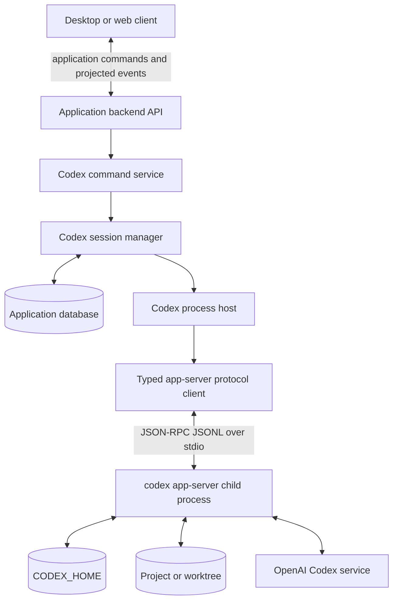
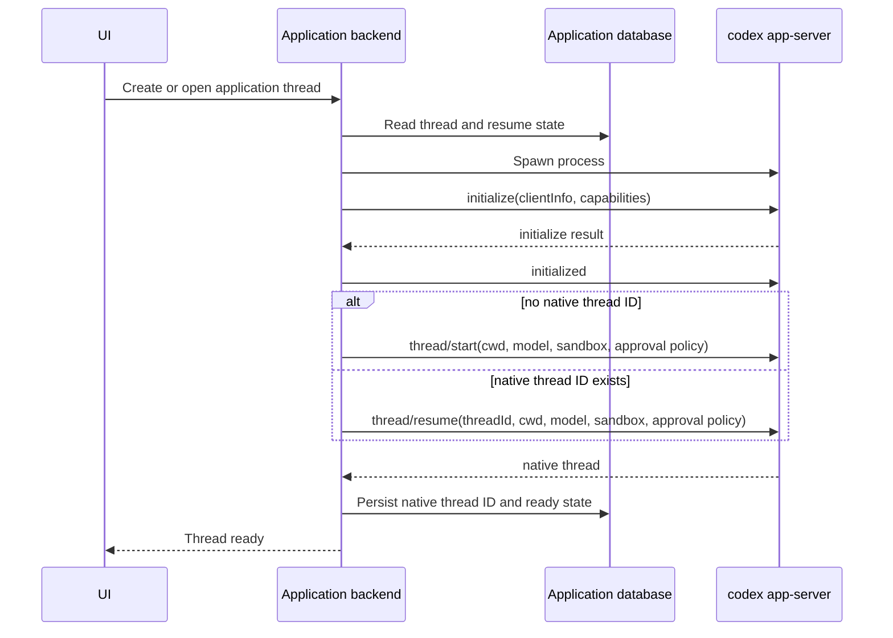
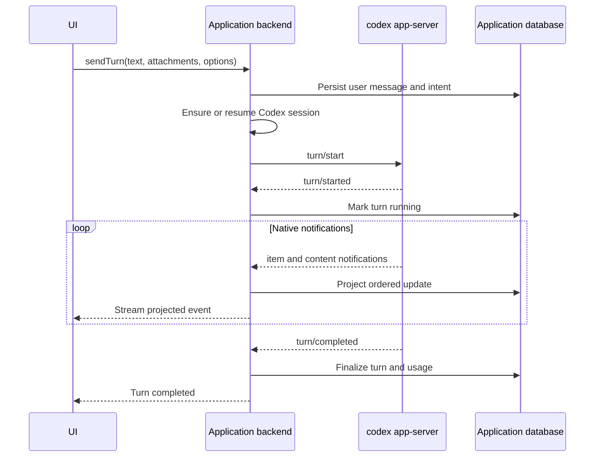
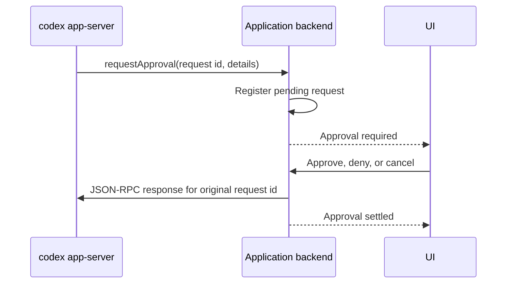

# Codex app-server architecture

Status: **Proposed, Codex-first MVP**

Scope: **Greenfield coding-agent product**

This document defines the first production architecture for an agent workspace built directly on
`codex app-server`. The goal is to prove the complete Codex experience before introducing a generic
provider abstraction.

It is intentionally self-contained. It does not describe, depend on, or expose the architecture of
an existing application.

The architecture deliberately uses Codex-native names, requests, events, and lifecycle rules. A
provider-neutral layer may be extracted later, but only from behavior that has been implemented,
observed, and validated end to end.

## Decision

The application will:

- run the locally installed Codex CLI as `codex app-server`
- use the default JSONL-over-stdio transport
- communicate with app-server using typed, schema-validated JSON-RPC
- run one app-server child process per active application thread
- persist the native Codex thread ID and lazily resume it in a new process
- keep app-server behind the application backend; clients never connect to it directly
- project Codex events into application UI state without first creating a generic provider model
- use Codex CLI authentication and `CODEX_HOME` rather than implementing OpenAI authentication
- pin and explicitly validate supported Codex CLI versions

The application will not use the OpenAI Agents SDK, the Responses API, or `codex exec` for
interactive conversations. `codex exec` may be considered separately for isolated background jobs
such as title or commit-message generation.

## Why app-server

App-server is the appropriate surface for a rich interactive client because it exposes:

- thread start, resume, read, fork, archive, and rollback operations
- turn start, steering, interruption, and completion
- incremental assistant and tool notifications
- bidirectional approval and user-input requests
- model, account, skill, configuration, and token-usage information
- Codex's native conversation persistence and resume identity

The published Codex SDK is a useful higher-level option, but app-server provides the protocol
control needed to build a first-class agent workspace and to validate the behavior that a future
abstraction would need to represent.

## Goals

1. Deliver a reliable local Codex conversation with streaming UI updates.
2. Preserve and resume Codex threads across application and child-process restarts.
3. Surface tool execution, file changes, approvals, plans, errors, and token usage.
4. Make runtime mode, working directory, model, reasoning effort, and interruption explicit.
5. Define process, protocol, persistence, and recovery behavior precisely enough to test.
6. Gather evidence for a later provider abstraction without designing that abstraction prematurely.

## Non-goals for the first milestone

- supporting Claude, OpenCode, Cursor, Grok, or another provider
- defining generic provider, session, turn, item, or capability interfaces
- implementing multi-agent handoffs with the OpenAI Agents SDK
- connecting the browser directly to app-server
- exposing app-server's experimental WebSocket listener on a network
- reconstructing Codex conversation history from the application's transcript
- reviving every historical thread and child process when the application starts
- treating every app-server method as an MVP requirement

## System context



Only the application backend owns child processes, credentials, native protocol messages, and
repository access. The client sees application commands, snapshots, and event streams.

## Component responsibilities

### Codex process host

The process host owns operating-system process behavior:

- resolves the configured Codex executable
- launches `codex app-server` without an intermediary shell
- sets the thread working directory
- supplies an explicit environment, including an optional `CODEX_HOME`
- exposes stdin, stdout, stderr, exit status, and process identity
- drains stderr independently from protocol stdout
- terminates the complete child-process tree on close or timeout
- guarantees idempotent close semantics

It does not understand threads, turns, approvals, or UI state.

### Typed app-server protocol client

The protocol client owns JSON-RPC framing and correlation:

- writes exactly one JSON message per line to stdin
- continuously reads and parses stdout lines
- allocates request IDs and correlates responses
- routes server notifications by method
- routes server-initiated requests to registered handlers
- validates known payloads against schemas generated for the supported Codex version
- preserves wire order for notifications and server requests
- fails pending requests when the process exits
- records bounded, redacted protocol diagnostics

Unknown notifications should be logged and ignored so a newer Codex version can add events without
immediately breaking the client. A malformed response to a request made by the application is a
protocol failure and must fail that request explicitly.

### Codex catalog service

Catalog and authentication checks are separate from conversation sessions. On demand, this service
uses a short-lived app-server process to perform:

```text
initialize
initialized
account/read
model/list
skills/list
```

The process is closed when the snapshot is complete. Results are cached with a short expiration and
refreshed explicitly after login, configuration, or Codex upgrades.

### Codex session manager

The session manager owns the mapping between an application thread and a live app-server process.
It:

- creates or resumes a native Codex thread
- enforces one live process per application thread
- serializes lifecycle transitions for that thread
- stores the native Codex thread ID as the resume identity
- exposes turn, interrupt, approval, user-input, read, and close operations
- tracks pending client requests and active turns
- closes inactive processes while keeping resumable state
- recovers lazily when the next operation targets a stopped session

This is a Codex-specific service. It should not implement a cross-provider session interface in the
MVP.

### Codex event projector

The projector consumes native app-server notifications and updates the application read model. It
may create application events for UI synchronization, but those events should retain Codex semantics
until a second provider proves which concepts are actually shared.

Responsibilities include:

- assistant text accumulation
- turn and item lifecycle state
- command, file-change, MCP, and collaboration activity
- approval and user-input presentation
- plans, diffs, token usage, and errors
- deduplication by native IDs and application sequence
- reconciliation after reconnect or process recovery

Raw protocol messages are diagnostic evidence, not the application's public API or primary database
model.

### Client gateway

The client gateway exposes a small application API:

```text
createThread
sendTurn
interruptTurn
respondToApproval
respondToUserInput
readThread
closeThreadSession
subscribeThread
```

The gateway accepts application IDs and resolves native Codex IDs on the server. It sends an initial
snapshot followed by ordered events with a resumable application sequence so UI reconnects do not
lose updates.

## Identity and source of truth

The application must keep these identities distinct:

| Identity              | Owner                     | Purpose                                  |
| --------------------- | ------------------------- | ---------------------------------------- |
| Application thread ID | Application database      | Stable routing and UI identity           |
| Codex thread ID       | Codex                     | Native conversation resume identity      |
| Application turn ID   | Application database      | UI and event projection identity         |
| Codex turn ID         | Codex                     | Native turn operations and notifications |
| JSON-RPC request ID   | One app-server connection | Request/response correlation only        |
| Approval request ID   | Live application session  | UI correlation for a server request      |

The sources of truth are:

- Codex thread history: Codex state under `CODEX_HOME`
- application metadata and UI projection: application database
- working tree contents and git state: filesystem and repository
- an in-flight approval: the live JSON-RPC connection that issued it

The application must never attempt to recreate a native Codex thread by replaying its projected chat
messages. It resumes with the Codex thread ID and reconciles its projection from native state and new
events.

## Process model

The MVP uses one app-server process per active application thread.

This is intentionally less resource-efficient than multiplexing many threads through one process,
but it provides:

- failure isolation between threads
- a fixed working directory and environment per process
- simple approval ownership and request correlation
- simple cleanup when a thread is closed or reconfigured
- a direct lifecycle relationship that is easy to test

The session manager may enforce global and per-profile concurrency limits. When a process is reaped,
its native Codex thread remains resumable.

Multiplexing threads on one app-server connection is a later optimization. It requires evidence that
process startup or memory is a real bottleneck and additional tests for routing, fairness, and failure
isolation.

## Connection and thread lifecycle



Initialization occurs once per child-process connection. No other app-server request is sent before
`initialize` succeeds and the `initialized` notification is written.

The initial capability set should stay on the stable app-server surface. Experimental API support
must be enabled only for a named MVP requirement, guarded by a compatibility test and recorded in the
supported-version matrix.

## Turn lifecycle



`turn/start` may include:

- text and supported attachments
- native Codex thread ID
- model and reasoning effort
- service tier when supported
- sandbox and approval policy
- collaboration or interaction mode when explicitly enabled

Only one active turn is allowed per application thread in the MVP. A second send is rejected or
translated to `turn/steer` only after steering has its own validated product behavior.

## Approvals and user-input requests

App-server can initiate JSON-RPC requests while a turn is running. These are not ordinary
notifications: Codex waits for the client response.



Rules:

- pending requests belong to one live process and connection
- application request IDs must not replace the original JSON-RPC ID
- responses are accepted at most once
- process exit cancels every pending request and marks it expired in the UI
- pending approvals are not replayed after restart
- late UI responses return a clear stale-request error
- approval details are treated as untrusted provider output and rendered safely

The same pattern applies to structured user-input requests.

## Runtime modes and safety

The application exposes explicit runtime modes rather than arbitrary Codex flags:

| Application mode | Codex sandbox        | Approval policy |
| ---------------- | -------------------- | --------------- |
| Read and propose | `read-only`          | `untrusted`     |
| Edit workspace   | `workspace-write`    | `on-request`    |
| Full access      | `danger-full-access` | `never`         |

The exact mapping is a product policy and must be covered by tests. Full access requires deliberate
user selection and must be visible while a turn is active.

Additional safeguards:

- use stdio locally; do not expose app-server WebSocket transport
- spawn with an argument array and no shell interpolation
- validate and normalize the working directory before launch
- keep credentials and sensitive environment values out of logs and command lines
- never send Codex authentication material to the UI
- redact protocol logs by schema-aware field rules
- cap line size, event queue size, attachment size, and retained diagnostic history
- terminate processes on application shutdown and verify child-tree cleanup on every platform

## Authentication and Codex profiles

The MVP relies on Codex CLI authentication. The catalog service calls `account/read`; when Codex
reports that authentication is required, the UI instructs the user to run `codex login` for the
selected profile.

A Codex profile contains:

- executable path
- `CODEX_HOME`
- allowed environment overrides
- optional launch arguments controlled by the application
- supported Codex version information

Different `CODEX_HOME` values are different continuation domains. A thread can only resume through a
profile that can access the Codex state containing its native thread ID. Profile switching in an
existing thread is deferred until this compatibility rule is proven.

## Persistence model

The minimum durable records are:

### `codex_threads`

```text
app_thread_id
codex_thread_id
profile_id
cwd
model
runtime_mode
status
last_seen_at
last_error
created_at
updated_at
```

### `codex_turns`

```text
app_turn_id
app_thread_id
codex_turn_id
status
started_at
completed_at
token_usage_json
last_error
```

### Application event log or projection tables

Persist enough ordered state to rebuild the UI:

- user and assistant messages
- streamed assistant segments or their compacted result
- tool and file-change activities
- turn status and errors
- completed approval records
- plans, diffs, and usage needed by the product

Every projected event receives a monotonic application sequence. Native Codex IDs are stored where
available for deduplication and reconciliation.

## Recovery behavior

### Application restart

Do not eagerly spawn processes for historical threads. Load durable thread metadata and start an
app-server process only when the user opens or sends to a thread.

### Child-process exit while idle

Mark the live session stopped, keep the native Codex thread ID, and lazily `thread/resume` later.

### Child-process exit during a turn

1. Fail all pending protocol calls and approvals.
2. Mark the application turn `unknown` or `interrupted`, not successful.
3. Preserve the native Codex thread ID.
4. On explicit retry or reopen, launch a new process and call `thread/resume`.
5. Use `thread/read` with turns included to reconcile the final native state.
6. Never resend the user's turn automatically unless idempotency has been proven.

### Resume failure

Classify failures into:

- native thread not found or unavailable
- incompatible `CODEX_HOME` or profile
- unsupported Codex version
- authentication required
- malformed or incompatible protocol
- repository or working-directory unavailable

Starting a fresh Codex thread is allowed only through an explicit product decision. Silent fallback
can split conversation history and should not be the default during validation.

## Backpressure and ordering

The stdout reader must never wait for database or UI work. It parses messages and places them into a
bounded per-session queue. A single ordered consumer performs projection.

When a queue reaches its limit:

- preserve lifecycle, approval, error, and completion messages
- coalesce high-frequency text or progress deltas when safe
- record a backpressure metric
- fail the session rather than silently losing non-coalescible events

All writes to child stdin pass through one serialized writer. Application event sequences are
assigned after ordered ingestion, not by concurrent UI handlers.

## Observability

Every operation should carry:

- application thread and turn IDs
- native Codex thread and turn IDs when known
- profile ID and Codex version
- process ID
- JSON-RPC method and request ID
- session and turn state transition
- queue depth and processing latency

Required metrics:

- process startup and initialization duration
- thread start and resume duration
- turn time to first event and time to completion
- approval wait duration
- process exits by code and lifecycle phase
- resume success and failure counts
- protocol decode failures by method
- event queue depth, coalescing, and overflow
- active and idle process counts

Protocol payload logging is disabled by default. Development logging must be bounded, redacted, and
separable from normal application logs.

## Version and schema policy

App-server schemas are tied to the Codex CLI version that generated them. The application must:

1. define a supported Codex version or version range
2. generate or update protocol schemas from that version
3. commit generated artifacts and a method coverage manifest
4. run compatibility tests before changing the supported version
5. reject known-incompatible versions with an actionable message
6. tolerate unknown notifications while preserving strict validation for invoked methods

Experimental methods and fields require an explicit feature flag and a version-specific test.

## Validation plan

### Phase 0: protocol spike

Prove with a real Codex installation:

- process launch and clean shutdown
- `initialize` followed by `initialized`
- `account/read`, `model/list`, and `skills/list`
- `thread/start`
- one `turn/start` with streamed assistant output
- `turn/completed`

Exit criterion: a CLI harness completes a turn and records an ordered, schema-valid transcript.

### Phase 1: lifecycle and resume

Prove:

- application-to-Codex ID mapping
- lazy process creation
- clean idle close
- process restart followed by `thread/resume`
- `thread/read` reconciliation
- `turn/interrupt`
- shutdown with no orphan processes on Windows, macOS, and Linux targets

Exit criterion: an automated test resumes a persisted thread after killing the original process and
continues the conversation without duplicating a turn.

### Phase 2: rich interaction

Prove:

- command-execution approvals
- file-change approvals
- structured user-input requests
- tool and file-change lifecycle events
- image attachments
- plans, token usage, and errors needed by the UI
- stale approval rejection and cancellation on process exit

Exit criterion: every user-blocking native request has an end-to-end UI path and deterministic
integration test.

### Phase 3: persistence and client synchronization

Prove:

- durable thread and turn projections
- snapshot plus ordered event subscription
- reconnect without missing or duplicating updates
- recovery after backend restart
- compaction of high-frequency deltas
- explicit handling of projection/native-state disagreement

Exit criterion: browser or desktop end-to-end tests survive client reconnect and backend restart
during representative thread lifecycles.

### Phase 4: reliability and performance

Run:

- repeated turn and long-running session tests
- parallel thread tests up to the intended process limit
- malformed JSON, delayed response, unknown notification, and abrupt-exit fault injection
- slow database and slow client backpressure tests
- Codex version upgrade compatibility tests
- memory, handle, and orphan-process checks

Exit criterion: agreed latency and resource budgets pass with no event loss or leaked process.

## Test strategy

Use three layers:

1. **Protocol tests** with a deterministic fake app-server peer over stdin/stdout. Cover framing,
   correlation, ordering, server requests, malformed messages, and process exit.
2. **Real Codex integration tests** against a pinned CLI in temporary repositories and isolated
   `CODEX_HOME` directories. Cover native lifecycle and compatibility.
3. **End-to-end client tests** through the real backend. Cover streaming, approvals, interruption,
   reconnect, restart, and resume.

Tests must assert observable state and protocol outcomes rather than sleeps or log text.

## Abstraction gate

A generic provider layer must not be introduced merely because another provider may be added later.
Extraction begins only after all of the following are true:

- the Codex phases above pass in automation
- the Codex-native command and event coverage matrix is documented
- session recovery and approval semantics are stable
- at least one production UI flow has exercised the design over time
- a second provider has been investigated deeply enough to compare concrete behavior
- shared concepts and irreducible differences are listed with examples
- the proposed interface can be expressed without hiding Codex capabilities or leaking Codex names

The likely future seam is around commands, capability discovery, and an ordered runtime-event stream.
It is not a commitment. The first abstraction proposal must be derived from the validated Codex
implementation and a real second implementation.

Until that gate is met, prefer small Codex-specific modules over speculative interfaces, adapter
factories, provider registries, or generic event taxonomies.

## Open decisions to resolve during the spike

- exact Codex CLI pinning and upgrade policy
- whether the MVP needs any experimental API fields
- database choice and event retention policy
- process concurrency and idle timeout limits
- attachment types and size limits
- which native tool activities require first-class UI versus diagnostic presentation
- whether `turn/steer`, `thread/fork`, and `thread/rollback` are MVP features
- whether application-specific MCP tools are needed before the core app-server lifecycle is proven

## External references

- [Codex app-server documentation](https://learn.chatgpt.com/docs/app-server.md)
- [Open-source Codex app-server](https://github.com/openai/codex/tree/main/codex-rs/app-server)
- [Codex SDK documentation](https://learn.chatgpt.com/docs/codex-sdk.md)
