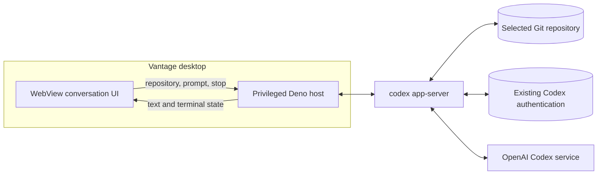
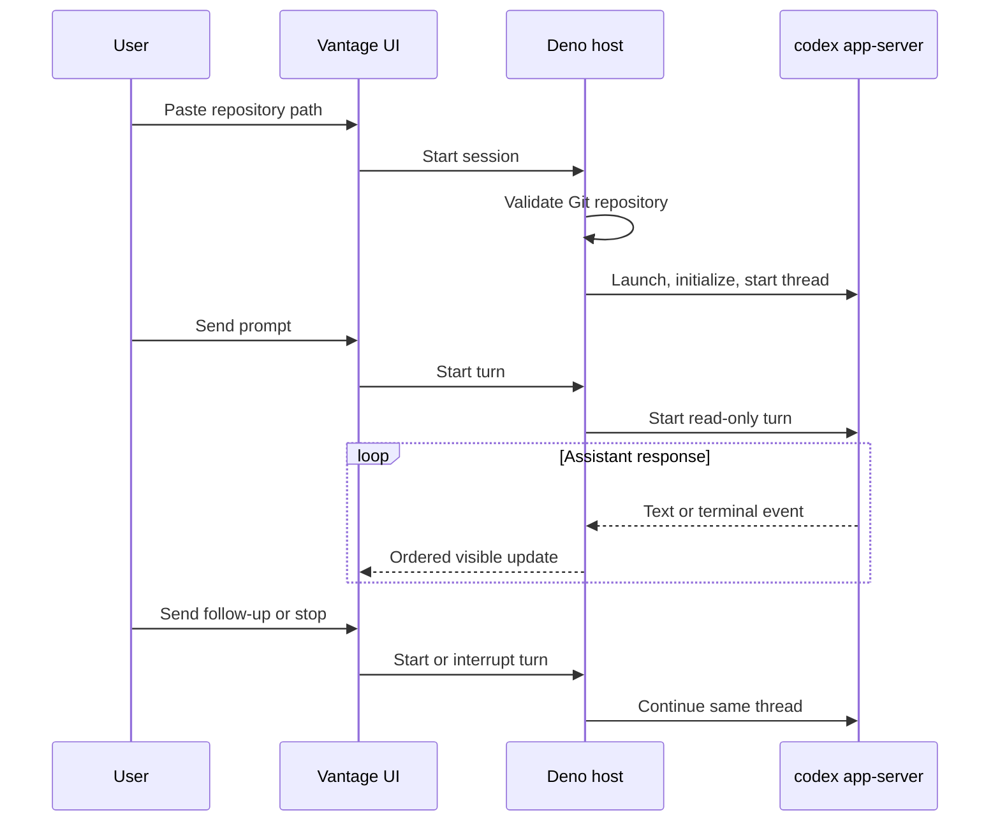

# Architecture overview

Status: **Accepted for the session-only Milestone 1**

This document owns the technical shape of the first implementation. The
[milestone map](../milestones/01-codex-chat.md) owns the delivery boundary and sequencing; the
[vertical-slice contract](vertical-slice.md) owns the user journey and behavior.

## Architectural outcome

Vantage is a Deno Desktop application with a WebView UI and a privileged Deno host. During one open
app session, the host validates one local Git repository, launches one `codex app-server`, keeps one
native Codex thread in memory, and forwards the minimum conversation state needed by the UI.

The implementation uses the user's existing Codex installation, authentication, and default model.
Codex is fixed to read-only access for this milestone. The UI never launches processes, reads Codex
credentials, or speaks the native app-server protocol directly.

## Current decisions

| Area | Milestone 1 decision |
| --- | --- |
| Desktop runtime | Deno Desktop on the primary development platform |
| UI boundary | WebView presentation with validated host commands and local streamed events |
| Provider | Codex through one local `codex app-server` process |
| Repository | One canonical, accessible Git repository selected by pasted or typed path |
| Conversation | One native thread held only for the open app session |
| Turns | Sequential text turns; one active turn at a time |
| Model and profile | Existing Codex defaults and authentication |
| Runtime policy | Fixed read-only access; no approval or mutation flow |
| Persistence | None; app close intentionally discards the conversation |
| Protocol surface | Only requests and events exercised by the session-only conversation |

The [decision log](decisions.md) records the scope reduction and preserves deferred design choices.

## System context

## Runtime boundaries

### WebView UI

The UI owns transient presentation state:

- repository-path input before the conversation begins;
- the visible user and assistant transcript;
- composer state;
- running, completed, interrupted, failed, and retryable states; and
- the stop control.

Every value from the host or Codex is untrusted presentation input. The UI does not receive
credentials, unrestricted environment values, raw process handles, or filesystem authority.

### Deno host

The host owns the privileged session:

- canonicalize the selected path and verify it is an accessible Git repository;
- launch and initialize one local app-server process without shell interpolation;
- start one native thread in that repository with read-only policy;
- serialize prompt and stop commands;
- translate only required assistant text and terminal lifecycle events for the UI; and
- terminate the native process when the window closes.

The host does not own a project registry, database, durable transcript, model catalog, approval
system, general event bus, or provider adapter.

### Codex child process

The app-server owns the native thread, turns, repository interaction, and communication with the
Codex service. Its identity is used only for same-session follow-ups. Vantage makes no claim that
the conversation can be recovered after app close.

## Interaction flow

## State and lifecycle

All Milestone 1 state is in memory. One repository is fixed for the session after the native thread
starts. A prompt cannot be submitted while native acceptance is unresolved or a turn is active.
Completion, interruption, and failure are visible terminal states; none is inferred from partial
assistant text.

Closing the app ends the session. The host closes or terminates the Vantage-owned app-server process
and the next launch begins without claiming that the repository or conversation was saved.

## Safety boundary

- Canonicalize and validate the repository before it becomes the native working directory.
- Use a fixed read-only policy so the milestone never depends on approval or file-mutation flows.
- Launch native processes with argument arrays rather than shell-built command strings.
- Keep Codex authentication and sensitive environment values out of WebView payloads and ordinary
  diagnostics.
- Reject duplicate prompt submission while a turn is unresolved or active.
- Render provider text without executing markup.
- Exercise idle and active window-close cleanup on the primary development platform.

## Validation boundary

Validation is attached to the two product paths:

- a focused deterministic check proves repository rejection, one-active-turn enforcement, ordered
  assistant text, terminal state, interruption, and process cleanup; and
- a packaged authenticated demonstration proves one repository-grounded prompt and a
  context-dependent follow-up on the primary development platform.

There is no standalone compatibility, stress, certification, or multi-platform test deliverable.

## Deferred design

The broader [Codex integration](codex-app-server.md) and
[reliability and validation](reliability.md) documents preserve possible future designs for saved
projects and threads, model controls, approvals, rich activity, persistence, restart recovery, and
operational hardening. They do not expand Milestone 1.

## References

- [Deno Desktop overview](https://docs.deno.com/runtime/desktop/)
- [Deno Desktop bindings](https://docs.deno.com/runtime/desktop/bindings/)
- [Deno Desktop HTTP serving](https://docs.deno.com/runtime/desktop/serving/)
- [Codex app-server](https://developers.openai.com/codex/app-server)
