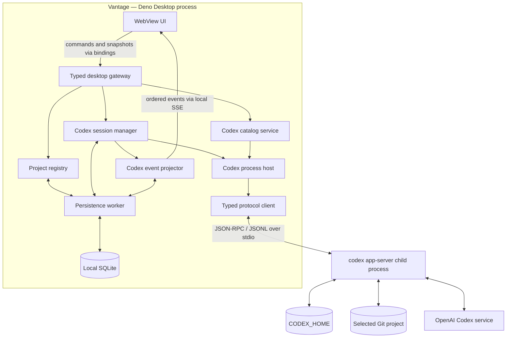
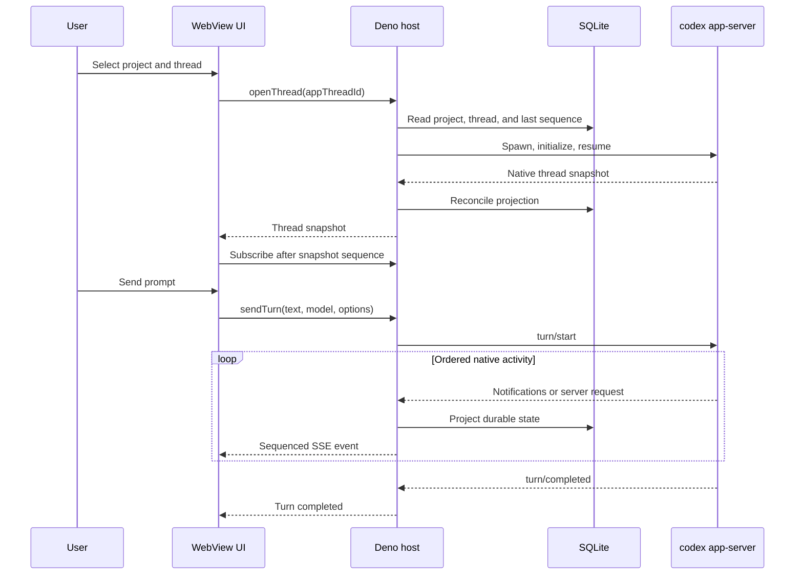

# Architecture overview

Status: **Accepted for the first vertical slice**, with provisional items called out below

This document describes the system at a high level. The current delivery boundary is the
[Codex chat vertical slice](vertical-slice.md). Native protocol mechanics are in
[Codex app-server integration](codex-app-server.md), and operational detail is in
[reliability and validation](reliability.md).

## Architectural outcome

Vantage is a Deno Desktop application with a web UI and a privileged Deno host runtime. The Deno
host owns local state, project access, and Codex child processes. The UI never launches Codex,
handles credentials, or speaks the native app-server protocol directly.

The first implementation is deliberately Codex-specific. Its job is to prove one complete,
resumable chat experience before Vantage introduces a provider abstraction or builds the other
product surfaces described in the foundation.

## Current decisions

| Area | Decision | Status |
| --- | --- | --- |
| Desktop runtime | Deno Desktop, pinned to a validated Deno 2.9 patch release | Accepted |
| Rendering backend | System WebView, with CEF retained as a compatibility fallback | Provisional |
| UI framework | Not selected by this architecture | Open |
| Provider | Codex through `codex app-server` | Accepted |
| Provider abstraction | None until the abstraction gate is met | Accepted |
| UI-to-host commands | Typed Deno Desktop bindings | Accepted |
| Host-to-UI stream | Same-origin Server-Sent Events with resumable sequence IDs | Provisional |
| App persistence | Local SQLite through `node:sqlite` in a dedicated persistence worker | Accepted |
| Codex process topology | One child process per live Vantage thread | Provisional |
| Codex authentication | Existing Codex CLI login and `CODEX_HOME` | Accepted |
| Project registration | Validated path entry for the first slice | Provisional |

The reasoning and superseded alternatives are recorded in the [decision log](decisions.md).

## System context



The WebView is an unprivileged presentation boundary. Binding input, SSE connection state, native
paths, and all Codex payloads must be validated even though they originate on the same machine.

## Runtime boundaries

### WebView UI

The UI owns transient presentation state:

- selected project and open thread routes;
- composer and model-control state;
- streamed message rendering;
- tool, approval, error, and connection presentation; and
- optimistic state that can be replaced by a host snapshot.

It calls a small typed gateway instead of filesystem or process APIs. On load or reconnect it asks
for a snapshot, then consumes ordered events after the snapshot sequence.

### Deno host runtime

The host is the trusted application backend inside the desktop process. It owns:

- project path validation and the project registry;
- local SQLite migrations and queries through a dedicated persistence worker;
- Codex executable discovery and version checks;
- Codex catalog, thread, turn, approval, and recovery services;
- child-process and shutdown behavior; and
- the application event sequence exposed to the UI.

The host uses Deno subprocess APIs with argument arrays, never a shell-built command string.

### Codex child process

Each live Vantage thread gets a locally launched `codex app-server`. Vantage initializes it over
JSONL stdio, starts or resumes one native Codex thread, and projects native events into UI state.
The native Codex thread ID is durable; the process is disposable.

## Desktop communication

Deno Desktop bindings are request/response calls from the WebView into the Deno runtime. Vantage
uses them for commands and snapshots:

```text
listProjects
registerProject
listThreads
createThread
openThread
listModels
sendTurn
interruptTurn
respondToApproval
respondToUserInput
readThreadSnapshot
```

Streaming is host-initiated, so the first slice uses an `EventSource` connection to a same-origin
SSE route served by the desktop app's own `Deno.serve()` handler. Every event carries a monotonic
application sequence. Reconnection supplies the last seen sequence; if retained events no longer
cover the gap, the UI replaces its state from a fresh snapshot.

This transport is an application seam, not a provider seam. Codex notifications do not cross into
the UI verbatim.

## State ownership

| State | Source of truth |
| --- | --- |
| Registered projects and preferences | Vantage SQLite database |
| Vantage thread identity and UI projection | Vantage SQLite database |
| Native conversation history | Codex state under the selected `CODEX_HOME` |
| Working files and Git state | Project filesystem and Git repository |
| Running turn and pending approval | Live app-server connection |
| Available models and account state | Codex app-server catalog snapshot |

Vantage stores native IDs needed to resume and reconcile, but it never rebuilds a Codex thread by
replaying the projected transcript.

## Main interaction flow



## Persistence shape

The first schema needs only enough state for the slice:

- `projects`: application ID, canonical path, display name, timestamps;
- `threads`: application ID, project ID, native Codex thread ID, profile, model, reasoning effort,
  runtime mode, lifecycle state, timestamps, and last error;
- `turns`: application ID, thread ID, native turn ID, state, usage, timestamps, and last error; and
- projected messages and activities with a monotonic application sequence.

The built-in `node:sqlite` API is synchronous, so Vantage owns the database in a dedicated worker.
SQLite writes must never block the host event loop or stdout reader. Native messages enter a bounded
ordered queue; projection and persistence happen from its consumer through that worker.

## Deno Desktop constraints

`deno desktop` was introduced in Deno 2.9 and is experimental at the time of this decision. The
first implementation therefore must:

- pin an exact Deno patch version in development and CI;
- keep desktop-specific calls behind a small host bootstrap and gateway;
- validate Codex process creation, stdio streaming, shutdown, and SQLite in a packaged build;
- test the system WebView before adopting CEF or promising identical cross-platform rendering;
- grant only the filesystem, subprocess, environment, and network permissions the packaged app
  requires; and
- treat app-level authorization as mandatory because compiled permissions alone do not express
  project- and turn-level policy.

Deno Desktop does not currently expose a first-class native folder picker. The vertical slice uses
a path field with canonicalization and Git-repository validation. A native picker may replace it
when Deno exposes one or a small, well-tested integration is justified.

## Architectural seams, not abstractions

Small module boundaries are still useful:

- desktop bootstrap and gateway;
- project registry and local store;
- Codex process host and typed protocol client;
- Codex catalog, session manager, and event projector; and
- UI snapshot/event reducer.

These boundaries isolate responsibilities and make tests possible. They must not become a generic
provider registry, universal agent event taxonomy, or adapter factory during the first slice.

## References

- [Deno Desktop overview](https://docs.deno.com/runtime/desktop/)
- [Deno Desktop bindings](https://docs.deno.com/runtime/desktop/bindings/)
- [Deno Desktop HTTP serving](https://docs.deno.com/runtime/desktop/serving/)
- [Deno Desktop backends](https://docs.deno.com/runtime/desktop/backends/)
- [Deno SQLite API](https://docs.deno.com/api/node/sqlite/)
