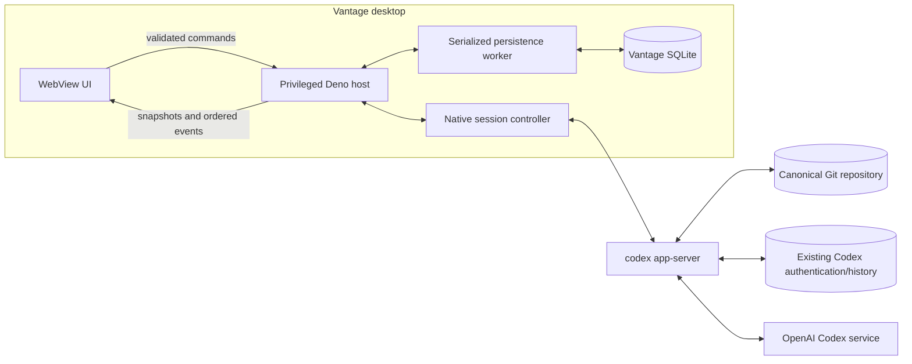
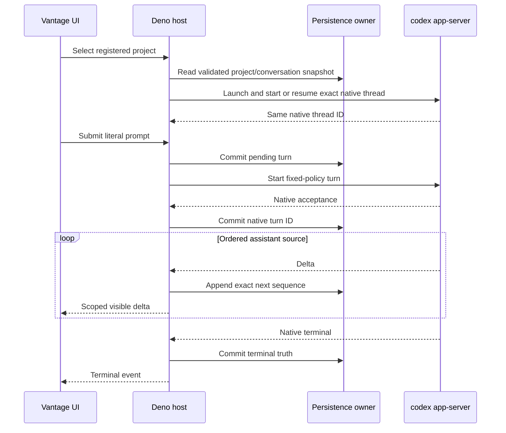

# Architecture overview

Status: **Accepted through the Milestone 3 saved-conversation foundation**

This set owns Vantage's implementation contracts. Milestone maps own delivery
scope and sequencing:

- [Milestone 1](../milestones/01-codex-chat.md) proved session-only native chat;
- [Milestone 2](../milestones/02-rich-markdown.md) added safe rich-response
  presentation; and
- [Milestone 3](../milestones/03-saved-projects-and-conversations.md) promotes
  saved projects and exact native conversation resume.

Issue #26 consumes the saved-project half of the accepted
[saved-project/conversation contract](saved-conversations.md): the UI persists
canonical project registrations, order, selection, availability, and explicit
removal in its sidebar. The selected chat remains session-only until issue #27
adds durable transcript projection, exact native resume, and relaunch
conversation continuation.

## Architectural outcome

Vantage is a Deno Desktop application with an unprivileged WebView presentation
boundary and a privileged Deno host. The host validates local Git roots,
launches and exactly reaps one owned `codex app-server`, enforces one active
turn, and translates the small native protocol surface needed by the product.

One serialized persistence worker owns Vantage's local SQLite connection. It is
a sibling of the native session controller: session events become typed,
project-scoped persistence operations, while database snapshots become validated
host/UI projections. Neither side receives the other's authority.

Codex remains the source of native thread and terminal truth. Git repositories
remain the source of repository truth. Vantage owns only its project registry,
native-ID mapping, literal prompt and ordered raw-source projection, and
preferences.

## Current decisions

| Area                   | Accepted decision                                                                                                                    |
| ---------------------- | ------------------------------------------------------------------------------------------------------------------------------------ |
| Desktop runtime        | Deno Desktop on the primary development platform                                                                                     |
| UI boundary            | WebView presentation with validated host commands, snapshots, and ordered events                                                     |
| Provider               | Codex through one local Vantage-owned `codex app-server` process                                                                     |
| Repository             | Validated canonical Git root; unique persisted registration in Milestone 3                                                           |
| Conversation           | One Vantage conversation per project, mapped to an exact durable native thread                                                       |
| Live session           | Disposable process/connection, distinct from durable conversation identity                                                           |
| Turns                  | One live/native turn globally; one unresolved durable turn per conversation; recovered read-only history may coexist across projects |
| Runtime policy         | Fixed `approvalPolicy: never` and read-only sandbox                                                                                  |
| Persistence            | Strict versioned SQLite schema through one serialized module worker                                                                  |
| Native resume          | `thread/resume` by persisted ID; returned ID must match; no transcript imitation                                                     |
| Assistant presentation | Ordered raw source re-rendered into inert Markdown and bounded visual DOM                                                            |

The [decision log](decisions.md) records why these choices were made and which
earlier deferrals they supersede.

## System context

```mermaid
flowchart LR
    subgraph Desktop["Vantage desktop"]
        UI["WebView UI"]
        HOST["Privileged Deno host"]
        SESSION["Native session controller"]
        STORE["Serialized persistence worker"]
        DB[("Vantage SQLite")]

        UI -->|"validated commands"| HOST
        HOST -->|"snapshots and ordered events"| UI
        HOST <--> SESSION
        HOST <--> STORE
        STORE <--> DB
    end

    CODEX["codex app-server"]
    REPO[("Canonical Git repository")]
    HOME[("Existing Codex authentication/history")]
    SERVICE["OpenAI Codex service"]

    SESSION <--> CODEX
    CODEX <--> REPO
    CODEX <--> HOME
    CODEX <--> SERVICE
```

## Runtime boundaries

### WebView UI

The UI owns transient presentation:

- project navigation and composer input when their owning issues land;
- visible literal prompts and safely rendered assistant source;
- running, completed, interrupted, failed, unavailable, and non-resumable
  states; and
- explicit send, stop, switch, remove, retry, and confirmation gestures.

Every host value is untrusted presentation input. The WebView never receives
credentials, unrestricted environment values, SQL, database paths, raw process
handles, native request IDs, filesystem authority, or direct app-server access.

### Privileged Deno host

The host owns orchestration:

- canonicalize and validate repository roots before registration or launch;
- keep at most one selected live native session;
- scope every native event and storage operation to exact durable identities;
- enforce active-turn switching, close, and cleanup policy;
- pass only typed operations to persistence; and
- pass only validated snapshots/events to the WebView.

The host does not parse SQL in the UI path, store Codex authentication, claim
ownership of repository contents/native history, or create a provider-neutral
framework.

### Persistence owner

One module worker owns `node:sqlite` and serializes all operations. It enforces
strict schema constraints, foreign keys, project/conversation/turn scope,
ordered deltas, transaction boundaries, migrations, and conservative
reconciliation. A second owner for the same canonical database path is rejected.

Exact schema, lifecycle, recovery, corruption, removal, and re-add semantics
live in [saved projects and conversations](saved-conversations.md).

### Codex child process

App-server owns native threads, turns, service interaction, and Codex history.
Vantage launches it without shell interpolation, consumes validated JSONL
responses/notifications, and terminates the exact process it owns. Durable
threads are non-ephemeral and survive that process.

The promoted protocol surface is documented in
[Codex app-server integration](codex-app-server.md).

## Interaction flow

```mermaid
sequenceDiagram
    participant UI as Vantage UI
    participant Host as Deno host
    participant Store as Persistence owner
    participant Codex as codex app-server

    UI->>Host: Select registered project
    Host->>Store: Read validated project/conversation snapshot
    Host->>Codex: Launch and start or resume exact native thread
    Codex-->>Host: Same native thread ID
    UI->>Host: Submit literal prompt
    Host->>Store: Commit pending turn
    Host->>Codex: Start fixed-policy turn
    Codex-->>Host: Native acceptance
    Host->>Store: Commit native turn ID
    loop Ordered assistant source
        Codex-->>Host: Delta
        Host->>Store: Append exact next sequence
        Host-->>UI: Scoped visible delta
    end
    Codex-->>Host: Native terminal
    Host->>Store: Commit terminal truth
    Host-->>UI: Terminal event
```

Issues #26 and #27 implement this integrated flow. Issue #25 proves and
constrains it.

## Safety and reliability boundary

- Canonicalize repository identity before persistence or native launch.
- Fix native work to read-only and `approvalPolicy: never`.
- Use process argument arrays, not shell-built command strings.
- Keep authentication, tokens, environment snapshots, database authority, and
  process handles out of storage and WebView payloads.
- Reject duplicate prompt submission while acceptance or a turn is unresolved.
- Persist raw source only, then reconstruct presentation through the inert-DOM
  renderer and unchanged offline CSP.
- Never replay uncertain prompts, infer terminal success, backfill an incomplete
  stream speculatively, or attach a late event across projects.
- Reap the prior owned process before activating another live project.
- Preserve corrupt or incompatible database bytes and stop mutation actionably.

## Validation boundary

Validation is attached to consumer-visible paths:

- deterministic unit tests protect repository validation, one-active-turn
  semantics, event order, interruption, safe rendering, storage transactions,
  migrations, reconciliation, and cleanup;
- the authenticated two-process proof protects exact native thread-ID and
  context continuity under the fixed policy; and
- packaged QA protects real WebView behavior, packaging, codesign, and exact
  process cleanup.

Broad provider abstraction, synchronization, write-enabled work, approvals,
multiple conversations, generalized event sourcing, compatibility certification,
multi-platform claims, and repair tooling remain outside this architecture
boundary.

## Documents

- [Decision log](decisions.md)
- [First vertical slice](vertical-slice.md)
- [Codex app-server integration](codex-app-server.md)
- [Saved projects and conversations](saved-conversations.md)
- [Rich response rendering](rich-response-rendering.md)
- [Reliability and validation](reliability.md)

## References

- [Deno Desktop overview](https://docs.deno.com/runtime/desktop/)
- [Codex app-server](https://developers.openai.com/codex/app-server)
