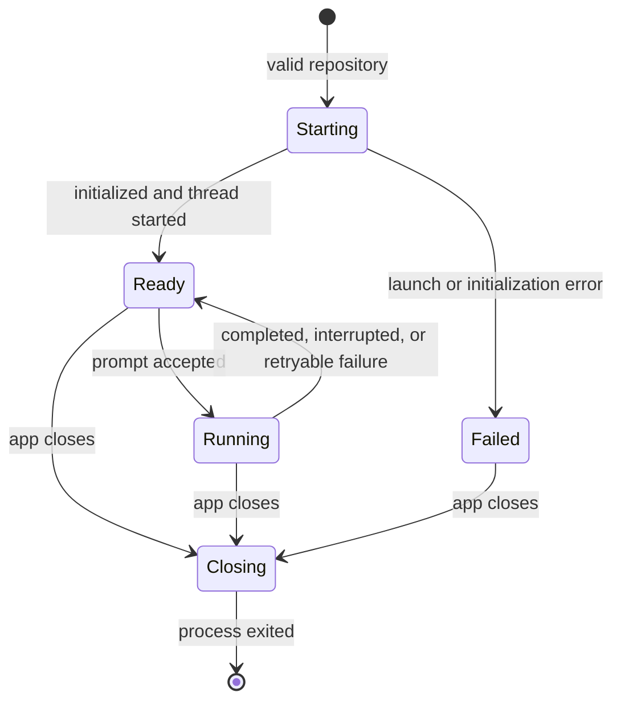

# Codex app-server integration

Status: **Accepted native boundary for the session-only Milestone 1**

This document owns the Codex-specific mechanics needed by the
[first vertical slice](vertical-slice.md). The [milestone map](../milestones/01-codex-chat.md) owns
scope; app-server capabilities not named here do not enter the milestone.

## Decision

Vantage launches one locally available `codex app-server` behind the privileged Deno host. It uses
the user's existing Codex authentication and default model, starts one native thread in the selected
repository, and keeps that process and thread only for the open app session.

The host speaks the native JSONL-over-stdio protocol. The WebView never connects to app-server,
handles credentials, or receives raw process authority.

## Required native behavior

| User behavior | Native capability |
| --- | --- |
| Start the repository-scoped session | initialize the connection and start one thread with the selected repository as its working directory |
| Ask a question | start one text turn with fixed read-only policy |
| Watch the answer | consume assistant text and turn terminal events in native order |
| Ask a follow-up | start another turn on the same in-memory native thread |
| Stop a response | request interruption and wait for a terminal state or connection failure |
| Close Vantage | close or terminate the Vantage-owned app-server process |

The implementation validates the request, response, and notification shapes it consumes. It does
not generate, commit, or certify the complete app-server protocol.

## Process boundary

The Deno host:

- resolves and launches Codex without shell interpolation;
- sets the selected canonical Git repository as the working directory;
- initializes one connection and native thread;
- serializes protocol writes;
- drains stdout and stderr separately;
- correlates only the requests needed by the two milestone issues;
- exposes assistant text and terminal lifecycle state to the UI; and
- makes idle and active close paths terminate the owned process.

Credentials, unrestricted environment values, raw native request IDs, and process handles do not
cross into the WebView.

## Session lifecycle

Only one turn may be active. A second prompt is rejected while native acceptance is unresolved or a
turn is running. Interruption remains pending until the native terminal state or connection failure
is known. Uncertain input is never submitted again automatically.

The native thread ID is held only to continue the conversation during the current app session.
Vantage does not persist it or claim restart recovery.

## Repository and runtime policy

The selected repository is canonicalized and validated before app-server starts. Every turn uses
that working directory. The milestone fixes Codex to read-only access so no command approval,
file-change approval, or structured-input UI is required.

The user's Codex installation and authentication are prerequisites. Missing Codex, initialization
failure, and authentication-required states are concise, actionable, and retryable; Vantage does not
implement login or token storage.

## Deferred capabilities

The following app-server capabilities are not scheduled for Milestone 1:

- model catalogs, reasoning selectors, profiles, and configuration editing;
- persisted thread identity, list/read/resume, restart reconciliation, fork, rollback, and archive;
- approvals, structured input, write-enabled work, and persistent policy;
- rich tool, plan, diff, usage, and file-change projection;
- attachments, application-specific MCP tools, dynamic tools, and handoffs;
- full generated schemas, method/event coverage manifests, compatibility ranges, and certification;
- remote transports and provider-neutral adapters.

Future milestones must promote capabilities because they enable a consumer-visible outcome, not
because app-server exposes them.

## References

- [Official Codex app-server documentation](https://developers.openai.com/codex/app-server)
- [Open-source Codex app-server](https://github.com/openai/codex/tree/main/codex-rs/app-server)
