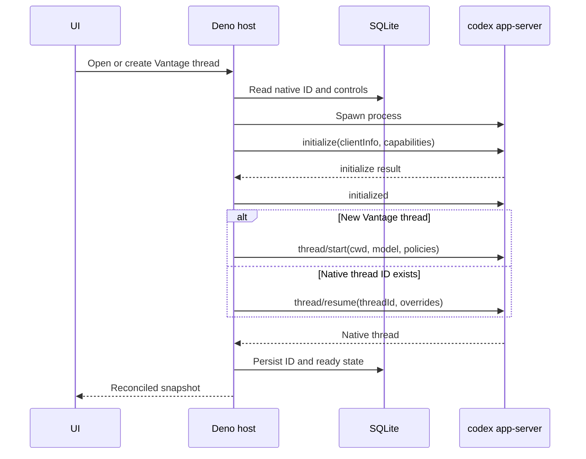
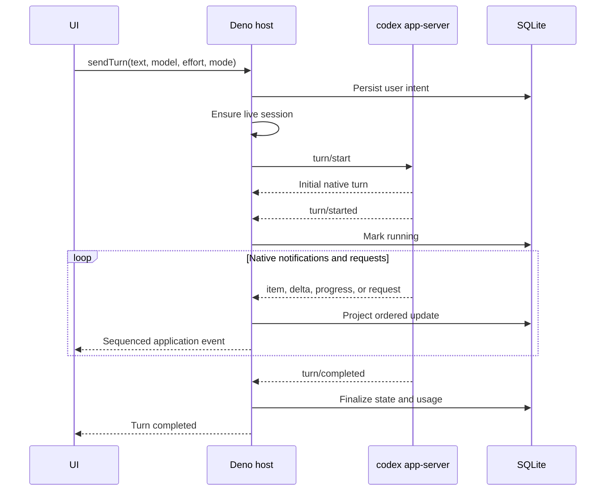
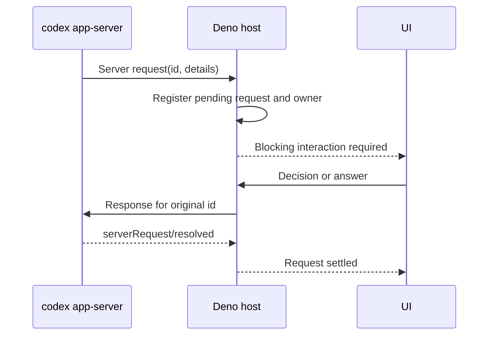

# Codex app-server integration

Status: **Accepted Codex-first design**

Scope: the native Codex boundary used by the [first chat vertical slice](vertical-slice.md)

This document defines how Vantage launches and communicates with `codex app-server`. It intentionally
uses Codex-native names, requests, events, and lifecycle rules. The surrounding desktop design is in
the [architecture overview](README.md); persistence, recovery, and testing are in
[reliability and validation](reliability.md).

## Decision

Vantage will:

- run a pinned, locally available Codex CLI as `codex app-server`;
- use the default JSONL-over-stdio transport;
- implement the bidirectional JSON-RPC-like protocol with generated TypeScript types and runtime
  validation;
- launch one child process per live Vantage thread during the first slice;
- persist the native Codex thread ID and lazily resume it in a later process;
- keep app-server behind the Deno host so the WebView never connects to it directly;
- project Codex events into application UI state while retaining native IDs and semantics; and
- use Codex-managed configuration, authentication, and `CODEX_HOME`.

Vantage will not use the Responses API, Agents SDK, Codex SDK, or `codex exec` for the interactive
chat path. Those are different integration surfaces with different lifecycle behavior.

## Why app-server

App-server is the supported integration surface for a rich Codex client. It provides:

- durable thread start, resume, read, fork, archive, and related operations;
- turn start, steering, interruption, and completion;
- typed item lifecycles and incremental assistant/tool notifications;
- bidirectional approval and structured user-input requests;
- model, account, configuration, skill, and usage information; and
- native conversation identity and history under Codex's control.

The first slice needs only a subset, but it needs the real lifecycle. A one-shot command cannot prove
resume, approvals, ordered activity, or recovery.

## Wire protocol

App-server uses JSON-RPC message shapes with the `jsonrpc: "2.0"` member omitted. Under the default
stdio transport, every message is one JSON object followed by a newline.

The protocol includes three directions:

- **client requests** with `method`, `id`, and `params`, followed by a server response;
- **server notifications** with `method` and `params`, with no response; and
- **server requests** with `method`, `id`, and `params`, which pause work until the client responds.

Stdout is protocol-only. Stderr is drained and logged separately. Vantage must never merge the two
streams or interpret stderr as JSONL.

## Components

### Codex process host

The process host owns operating-system behavior:

- resolve the selected Codex executable without invoking a shell;
- launch `codex app-server` with an argument array;
- set an explicit environment, including the selected `CODEX_HOME` when configured;
- expose stdin, stdout, stderr, process ID, exit status, and close state;
- continuously drain stdout and stderr;
- terminate the process and its descendants on close or timeout; and
- make close idempotent.

It does not know about Codex threads, turns, approvals, or UI projection.

### Typed protocol client

The protocol client owns framing and correlation:

- serialize every stdin write through one writer;
- allocate connection-local request IDs and correlate responses;
- parse stdout one bounded line at a time;
- route notifications by method;
- route server requests to registered handlers;
- validate invoked methods and known payloads against generated schemas;
- preserve wire order for notifications and server requests;
- fail pending client requests when the process exits; and
- retain bounded, redacted diagnostic metadata.

Unknown notifications from a newer compatible CLI are recorded and ignored. A malformed response to
a method Vantage invoked fails that request explicitly. A malformed lifecycle event fails or
degrades the session rather than being silently projected as valid state.

### Codex catalog service

Catalog and authentication checks are not tied to a conversation. On demand, a short-lived
app-server process performs:

```text
initialize
initialized
account/read
model/list
```

The snapshot is cached briefly and refreshed explicitly after authentication, configuration, or CLI
version changes. The model selector uses returned visibility, default, effort, and modality fields;
it does not use a hard-coded model list.

`skills/list` and broader configuration/catalog surfaces can be added when a product slice uses
them. They are not required merely because the native API exposes them.

### Codex session manager

The session manager maps a Vantage thread to its live app-server process. It:

- creates or resumes a native Codex thread;
- enforces at most one live process per Vantage thread;
- serializes lifecycle transitions for the thread;
- stores the native thread ID as the resume identity;
- exposes turn, interrupt, approval, user-input, read, and close operations;
- tracks the active turn and pending server requests;
- closes inactive processes without deleting the native thread; and
- recovers lazily when a stopped session is used again.

This is a Codex-specific service, not a provider interface.

### Codex event projector

The projector consumes native notifications and server-request lifecycle updates in wire order. It
updates Vantage's durable read model and emits application events for the UI.

It handles:

- assistant message accumulation;
- thread, turn, and item lifecycle;
- command, file-change, MCP, and collaboration activity;
- approvals and structured user input;
- plans, diffs, token usage, warnings, and errors;
- deduplication using native IDs and application sequence; and
- reconciliation after process or UI reconnect.

Raw protocol payloads are diagnostic evidence, not the application's public API or primary database
model.

## Identity

These identities must remain distinct:

| Identity | Owner | Purpose |
| --- | --- | --- |
| Vantage project ID | Vantage | Stable sidebar and project routing |
| Vantage thread ID | Vantage | Stable application and UI identity |
| Codex thread ID | Codex | Native history and resume identity |
| Vantage turn ID | Vantage | Projection and UI identity |
| Codex turn ID | Codex | Native turn operations and events |
| JSON-RPC request ID | One connection | Request/response correlation only |
| Server-request ID | One live connection | Approval or user-input response correlation |

Vantage never recreates a native Codex thread by replaying its projected messages. It resumes by
native thread ID and reconciles from native state.

## Required native coverage

The first slice needs the following method families from the pinned schema:

| Concern | Methods or notifications |
| --- | --- |
| Connection | `initialize`, `initialized` |
| Account and models | `account/read`, `model/list` |
| Thread | `thread/start`, `thread/resume`, `thread/read`, `thread/started`, thread status events |
| Turn | `turn/start`, `turn/interrupt`, `turn/started`, `turn/completed` |
| Item stream | `item/started`, `item/completed`, supported `item/*/delta` and progress events |
| Rich state | plan, diff, warning, error, model-routing, and token-usage notifications observed in the pinned schema |
| Blocking requests | command approval, file-change approval, structured user input, and `serverRequest/resolved` |

Names and payload unions must come from generated artifacts. The coverage manifest records which
members are rendered richly, rendered as truthful fallback activity, ignored intentionally, or not
yet supported.

## Connection and thread lifecycle



Exactly one `initialize` request is sent per connection, before any other request, followed by the
`initialized` notification. Repeated initialization or pre-initialization requests are protocol
errors.

The initial capability set remains on stable app-server features. Experimental capability flags are
enabled only for a named vertical-slice requirement, a pinned-schema test, and an entry in the
coverage manifest.

## Turn lifecycle



Only one active turn is allowed per Vantage thread. A second send is rejected. `turn/steer` is
deferred until it has an explicit UI behavior and tests.

`turn/interrupt` returning successfully means cancellation was requested; the UI remains in a
stopping state until the native `turn/completed` reports `interrupted` or the connection fails.

## Model and reasoning controls

`model/list` is the only source for picker-visible models. Vantage uses each model's native ID,
default reasoning effort, supported reasoning efforts, and modalities. Hidden models remain hidden
in the first slice.

The selected model and effort are stored as Vantage thread defaults. A turn uses the supported
`turn/start` override fields from the pinned schema. Controls cannot change while a turn is active.
If resume reports a native model-switch warning, it is surfaced rather than suppressed.

## Approvals and user-input requests

App-server can send a request while a turn is running. That request pauses work until Vantage sends a
response using the original connection-local request ID.



Rules:

- pending requests belong to one process, connection, thread, and turn;
- Vantage IDs never replace the original protocol request ID;
- a response is accepted at most once;
- process exit expires all pending requests;
- pending requests are not replayed after restart;
- late or duplicate UI responses return a stale-request error; and
- request text, commands, paths, and schemas are untrusted provider output and rendered safely.

The projector must support the exact decision unions generated for command and file-change
approvals. It must also handle `serverRequest/resolved`, because Codex may clear a pending prompt on
turn completion or interruption before the UI answers.

## Runtime modes and safety

Vantage exposes named modes instead of raw native fields. The initial mapping is:

| Vantage mode | Native sandbox policy | Native approval policy |
| --- | --- | --- |
| Read and propose | `readOnly` | `unlessTrusted` |
| Edit workspace | `workspaceWrite` scoped to the project | `onRequest` |
| Full access | `dangerFullAccess` | `never` |

The exact values are compiled from the pinned schema and tested. Full access requires deliberate
selection and remains visible during the turn. Effective Codex configuration or organization
requirements may disallow a requested combination; Vantage reports that conflict instead of
weakening or silently replacing policy.

Additional safeguards:

- keep app-server on stdio; do not expose its WebSocket listener;
- canonicalize the project path before it becomes `cwd`;
- spawn without shell interpolation;
- keep credentials and sensitive environment values out of logs and arguments;
- never send Codex authentication material to the WebView;
- cap protocol line, input, attachment, queue, and diagnostic sizes; and
- verify descendant-process cleanup on every supported operating system.

## Authentication and profiles

The first slice relies on Codex's existing managed authentication state. The catalog process calls
`account/read`. If authentication is required, Vantage gives the user an actionable instruction to
authenticate with the selected CLI profile, then allows an explicit refresh.

Vantage does not own access or refresh tokens in this slice even though app-server exposes login
methods.

A Codex profile contains:

- executable path;
- `CODEX_HOME`;
- allow-listed environment overrides; and
- pinned or supported Codex version metadata.

Different `CODEX_HOME` values are different continuation domains. A thread can resume only through a
profile that can see its native state. Switching the profile of an existing thread is deferred.

## Version and schema policy

Generated TypeScript and JSON Schema artifacts are specific to the Codex CLI version that produced
them. Vantage must:

1. pin a Codex version during the first slice;
2. generate and commit TypeScript definitions and schema artifacts from that binary;
3. commit a method/event coverage manifest;
4. run real compatibility tests before changing the pin or supported range;
5. reject known-incompatible versions with a useful message; and
6. tolerate unknown notifications while strictly validating methods Vantage invokes.

The protocol is designed for backward compatibility, so a tested range may replace the exact pin
later. That policy follows evidence; it does not replace initial validation.

## Deferred native features

The first slice does not expose `turn/steer`, thread fork/archive/rollback, review, direct command or
process APIs, dynamic tools, application-owned authentication, remote WebSocket transport,
attachments, or experimental permission profiles. Their presence in generated schemas is not a
requirement to implement them.

## References

- [Official Codex app-server documentation](https://developers.openai.com/codex/app-server)
- [How OpenAI built the App Server](https://openai.com/index/unlocking-the-codex-harness/)
- [Open-source Codex app-server](https://github.com/openai/codex/tree/main/codex-rs/app-server)
