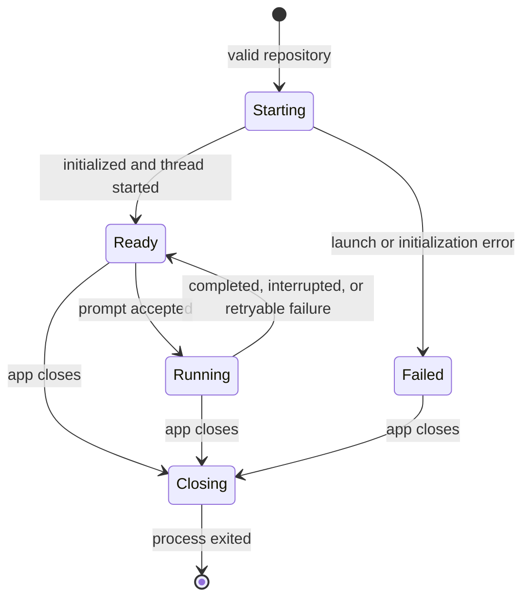

# Codex app-server integration

Status: **Accepted native boundary through the Milestone 3 durable-resume foundation**

This document owns Codex-specific mechanics used by the
[first vertical slice](vertical-slice.md) and promoted by the
[saved-conversation contract](saved-conversations.md). Milestone maps own scope;
app-server capabilities not named here do not enter the active vertical.

## Decision

Vantage launches one locally available `codex app-server` behind the privileged Deno host. It uses
the user's existing Codex authentication and default model. Milestones 1 and 2 started an
ephemeral native thread for the open app session. Milestone 3 promotes non-ephemeral thread
creation and exact-ID resume while keeping the process disposable.

The host speaks the native JSONL-over-stdio protocol. The WebView never connects to app-server,
handles credentials, or receives raw process authority.

## Required native behavior

| User behavior | Native capability |
| --- | --- |
| Start the repository-scoped session | initialize the connection and start one thread with the selected repository as its working directory |
| Ask a question | start one text turn with fixed read-only policy |
| Watch the answer | consume assistant text and turn terminal events in native order |
| Ask a follow-up | start another turn on the same in-memory native thread |
| Stop a response | request interruption and wait for a terminal state or connection failure |
| Close Vantage | close or terminate the Vantage-owned app-server process |
| Create durable native context | `thread/start` with `ephemeral: false` and persist the returned ID |
| Relaunch or switch back | `thread/resume` by persisted ID and require the same ID in the response |
| Classify unavailable context | preserve saved source as read-only and mark the mapping non-resumable |

Every thread start, resume, and turn repeats the canonical repository and fixed
`approvalPolicy: "never"`/read-only policy. The implementation validates the
request, response, and notification shapes it consumes. It does not generate,
commit, or certify the complete app-server protocol.

## Process boundary

The Deno host:

- resolves and launches Codex without shell interpolation;
- sets the selected canonical Git repository as the working directory;
- initializes one connection and starts or resumes one native thread;
- serializes protocol writes;
- drains stdout and stderr separately;
- correlates only the requests needed by the two milestone issues;
- starts durable threads or resumes the exact persisted native ID for Milestone 3;
- exposes assistant text and terminal lifecycle state to the UI; and
- makes idle and active close paths terminate the owned process.

Credentials, unrestricted environment values, raw native request IDs, and process handles do not
cross into the WebView.

## Session lifecycle

```mermaid
stateDiagram-v2
    [*] --> Starting: valid repository
    Starting --> Ready: initialized and thread started
    Starting --> Failed: launch or initialization error
    Ready --> Running: prompt accepted
    Running --> Ready: completed, interrupted, or retryable failure
    Ready --> Closing: app closes
    Running --> Closing: app closes
    Failed --> Closing: app closes
    Closing --> [*]: process exited
```

Only one turn may be active. A second prompt is rejected while native acceptance is unresolved or a
turn is running. Interruption remains pending until the native terminal state or connection failure
is known. Uncertain input is never submitted again automatically.

For the Milestone 3 integrated path, the native thread ID is committed through
the serialized persistence owner and outlives the live session. A new process
uses `thread/resume` with that ID; returned identity must match. Transcript
replay, client-supplied history, and silent replacement threads cannot satisfy
resume.

The issue #25 proof exercises this sequence directly:

1. initialize authenticated app-server A;
2. start a non-ephemeral read-only thread and complete a marker turn;
3. terminate and reap A;
4. initialize app-server B;
5. resume the same ID and complete a follow-up that requires the marker; and
6. archive the explicitly temporary proof thread and reap B.

Application project removal does not call native archive or delete. The current
API exposes archive, unarchive, and delete, but Codex history is not
Vantage-owned.

## Repository and runtime policy

The selected repository is canonicalized and validated before app-server starts. Every turn uses
that working directory. The milestone fixes Codex to read-only access so no command approval,
file-change approval, or structured-input UI is required.

The user's Codex installation and authentication are prerequisites. Missing Codex, initialization
failure, and authentication-required states are concise, actionable, and retryable; Vantage does not
implement login or token storage.

## Deferred capabilities

The following app-server capabilities remain outside Milestone 3:

- model catalogs, reasoning selectors, profiles, and configuration editing;
- native thread list/history UI, fork, rollback, rename, delete, and application-driven archive;
- approvals, structured input, write-enabled work, and persistent policy;
- rich tool, plan, diff, usage, and file-change projection;
- attachments, application-specific MCP tools, dynamic tools, and handoffs;
- full generated schemas, method/event coverage manifests, compatibility ranges, and certification;
- remote transports and provider-neutral adapters.

Future milestones must promote capabilities because they enable a consumer-visible outcome, not
because app-server exposes them.

## References

- [Official Codex app-server documentation](https://developers.openai.com/codex/app-server)
- [Open-source Codex app-server](https://github.com/openai/codex/tree/main/codex-rs/app-server)
