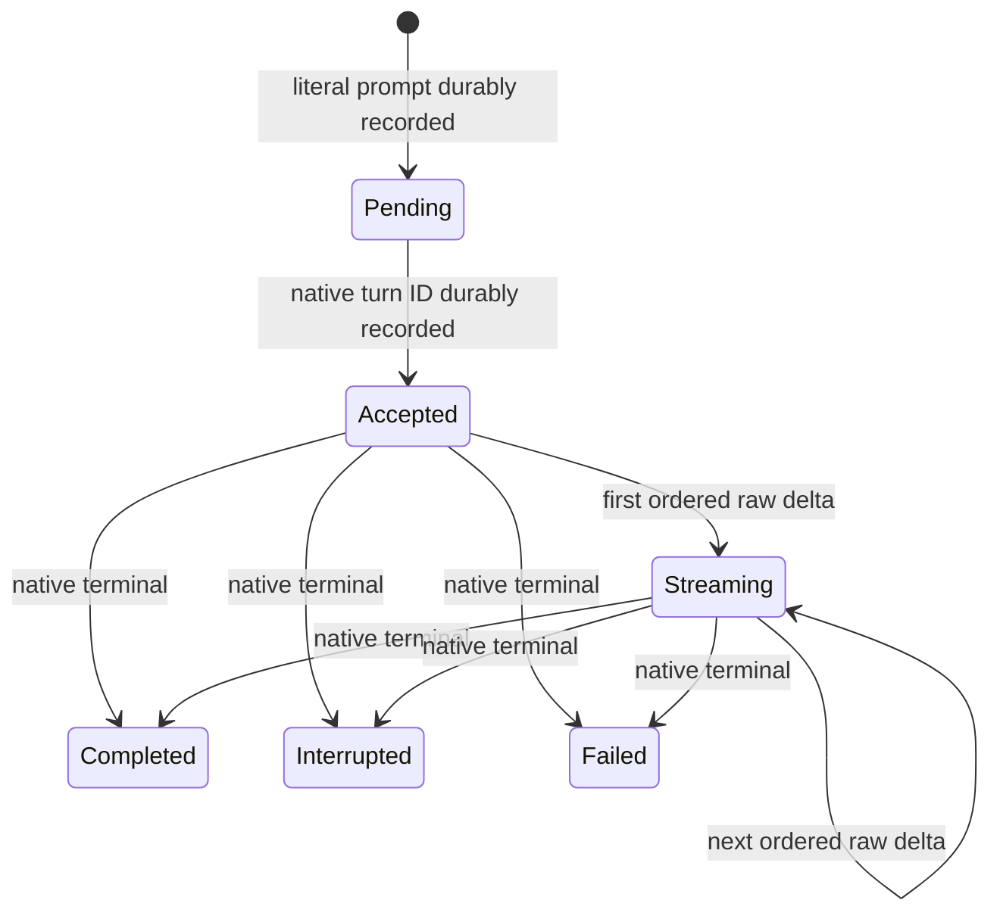

# Saved projects and conversations

Status: **Accepted and implemented through Milestone 3 issue #27**

The [Milestone 3 map](../milestones/03-saved-projects-and-conversations.md) owns
the wider product boundary and sequencing. This document owns the persistence,
native-resume, lifecycle, reconciliation, corruption, removal, and re-add
contract consumed by issues #26 and #27.

Issue #25 establishes the storage and native-resume foundation. Issues #26 and
#27 connect it to the saved-project sidebar and one durable conversation per
project.

## Decision

Vantage owns one local SQLite database through one serialized persistence
worker. The worker is beside, not inside, the native session controller. It owns
the only application connection and returns validated records and snapshots to
the privileged host. The WebView never receives a database path, connection, SQL
authority, native process handle, or native protocol authority.

Vantage persists only:

- its project registrations and preferences;
- one Vantage conversation identity per registered project;
- the corresponding native Codex thread ID and resumability state;
- literal user prompts;
- ordered raw assistant-source deltas; and
- native acceptance and terminal truth.

Codex history and local Git repositories remain external sources of truth.
Rendered HTML, live DOM, parsed Markdown trees, SVG DOM, process state,
credentials, authentication tokens, environment snapshots, executable
representations, and arbitrary provider-selected HTML objects are not database
records. Raw assistant source remains inert UTF-8 text even when it contains
characters that resemble markup; it is always re-rendered through the
[safe rich-response boundary](rich-response-rendering.md).

## Canonical project identity

A project is identified by the canonical Git top-level path returned by the
existing repository validator:

1. trim the user-entered path;
2. resolve filesystem aliases with `realPath`;
3. require an accessible directory;
4. run `git -C <candidate> rev-parse --show-toplevel` without shell
   interpolation; and
5. resolve the returned root with `realPath` again.

`projects.canonical_root` is unique. A nested path, symlink alias, or alternate
spelling of the same accessible Git root therefore cannot create a second
registration. Filesystem identity beyond the canonical path—device/inode,
worktree common-dir, remote URL, or repository contents—is not part of the
Milestone 3 identity.

A missing root does not delete or rewrite registration state. It makes the
project unavailable and blocks native launch until the same canonical root is
accessible again or the user explicitly removes the project.

## Database location and ownership

The integrated application in issues #26 and #27 will place `vantage.sqlite3` in
Vantage's per-user application-support directory
(`~/Library/Application Support/Vantage/` on the primary macOS platform). Tests
and proof tooling pass an explicit fixture path.

`PersistenceOwner.open(path)` canonicalizes the containing directory, reserves
that database path for the lifetime of the owner, and starts one module worker.
Only that worker imports `node:sqlite` and owns `DatabaseSync`. The worker's
message queue and synchronous transaction execution serialize all operations. A
second owner for the same canonical path is rejected. Closing the owner closes
SQLite, terminates the worker, rejects pending work, and releases the path
reservation.

The database uses SQLite foreign keys and strict tables. The host passes typed
operations, not SQL. Each operation includes project and conversation identity;
turn mutations also include turn identity. The worker verifies the full
project→conversation→turn scope before mutation, preventing a late event from
attaching to another project.

## Schema and migrations

`PRAGMA user_version` is the sole schema-version marker. The current version is
2.

### Version 1

`projects`

| Column                                | Contract                            |
| ------------------------------------- | ----------------------------------- |
| `id TEXT PRIMARY KEY`                 | Fresh Vantage-owned opaque identity |
| `canonical_root TEXT UNIQUE NOT NULL` | Canonical Git top-level path        |
| `created_at INTEGER NOT NULL`         | Non-negative epoch milliseconds     |

`conversations`

| Column                              | Contract                                                          |
| ----------------------------------- | ----------------------------------------------------------------- |
| `id TEXT PRIMARY KEY`               | Fresh Vantage-owned opaque identity                               |
| `project_id TEXT UNIQUE NOT NULL`   | Cascading FK to `projects`; enforces one conversation per project |
| `native_thread_id TEXT UNIQUE`      | Exact Codex-owned durable thread ID, if established               |
| `native_resume_state TEXT NOT NULL` | `unstarted`, `resumable`, or `non_resumable`                      |
| `native_resume_failure TEXT`        | `missing`, `incompatible`, or `resume_failed` when non-resumable  |
| `created_at INTEGER NOT NULL`       | Non-negative epoch milliseconds                                   |

Checks require:

- `unstarted` to have no native ID or failure;
- `resumable` to have a native ID and no failure; and
- `non_resumable` to have an explicit stable failure reason.

`preferences`

| Column                        | Contract                        |
| ----------------------------- | ------------------------------- |
| `key TEXT PRIMARY KEY`        | Vantage-owned preference key    |
| `value_json TEXT NOT NULL`    | Valid JSON only                 |
| `updated_at INTEGER NOT NULL` | Non-negative epoch milliseconds |

No preference may contain Codex credentials, tokens, or an environment snapshot.

### Version 2

`turns`

| Column                          | Contract                                                                    |
| ------------------------------- | --------------------------------------------------------------------------- |
| `id TEXT PRIMARY KEY`           | Vantage-owned turn identity                                                 |
| `conversation_id TEXT NOT NULL` | Cascading FK to `conversations`                                             |
| `ordinal INTEGER NOT NULL`      | Zero-based order, unique within the conversation                            |
| `prompt TEXT NOT NULL`          | Literal submitted user source; never trimmed or rendered by storage         |
| `phase TEXT NOT NULL`           | `pending`, `accepted`, `streaming`, `completed`, `interrupted`, or `failed` |
| `native_turn_id TEXT`           | Native acceptance identity, unique within the conversation                  |
| `terminal_status TEXT`          | Native `completed`, `interrupted`, or `failed` truth                        |
| `recovery_disposition TEXT`     | Conservative classification for an unresolved session loss                  |
| `session_loss_reason TEXT`      | `clean_close` or `crash` when recovery is required                          |
| `created_at INTEGER NOT NULL`   | Non-negative epoch milliseconds                                             |
| `accepted_at INTEGER`           | Set atomically with native acceptance                                       |
| `terminal_at INTEGER`           | Set atomically with terminal truth                                          |

Checks bind pending rows to no native acceptance; accepted/streaming rows to a
native turn ID and acceptance timestamp; and terminal phases to the identical
terminal status plus terminal timestamp. A recovery disposition and loss reason
must appear together and cannot coexist with terminal truth.

`assistant_deltas`

| Column                      | Contract                       |
| --------------------------- | ------------------------------ |
| `turn_id TEXT NOT NULL`     | Cascading FK to `turns`        |
| `sequence INTEGER NOT NULL` | Exact zero-based arrival order |
| `source TEXT NOT NULL`      | Raw assistant-source fragment  |

`(turn_id, sequence)` is the primary key. Appending requires `sequence` to equal
the current fragment count. Duplicate and out-of-order fragments reject the
whole transaction. Reading concatenates fragments in sequence order and returns
both the source and fragment count; rendered projections are rebuilt, never
loaded.

### Migration procedure

Opening storage performs these steps in order:

1. open the requested path without deleting, renaming, truncating, or replacing
   an existing file;
2. enable foreign keys;
3. require `PRAGMA quick_check` to return `ok`;
4. read `user_version`;
5. reject versions newer than the application supports; and
6. apply every missing migration in its own `BEGIN IMMEDIATE` transaction,
   updating `user_version` in the same transaction.

Migrations are forward-only and deterministic. A failed migration rolls back;
there is no automatic downgrade, salvage rewrite, empty-database replacement, or
destructive retry.

## Transaction boundaries

The following facts commit atomically:

- project plus its single conversation;
- a native-thread mapping or non-resumable classification;
- one literal pending turn;
- native acceptance plus the native turn ID;
- one ordered source fragment plus transition to `streaming`;
- terminal phase, status, and timestamp;
- session-loss recovery annotations for all unresolved turns in one
  conversation; and
- project removal plus all cascading Vantage-owned conversation data.

A native durable thread is created outside SQLite. If the app-server succeeds
but mapping persistence fails, the result is an unreferenced Codex-owned thread,
not a fabricated Vantage conversation. Vantage reports the storage failure and
does not retry the prompt or claim continuity.

## Turn lifecycle

Only one `pending`, `accepted`, or `streaming` turn may exist in each
conversation. This is a per-conversation durability invariant, not a global
database limit: multiple projects may retain recovered unresolved rows as
read-only history. Only the selected project may own the single live/native turn
globally. A pending row is created before native dispatch. Native acceptance
transitions that exact scoped row; deltas and terminal events require the same
project/conversation/turn identities. Terminal status is never inferred from
text, process exit, elapsed time, or a saved transcript.

## Native thread creation and resume

The authenticated issue #25 proof fixes the native contract:

- create with `thread/start`, `ephemeral: false`, the canonical repository
  `cwd`, `approvalPolicy: "never"`, and `sandbox: "read-only"`;
- terminate and reap the first Vantage-owned app-server;
- initialize a new app-server process;
- resume with `thread/resume` by the persisted native thread ID, with the same
  repository and policy overrides;
- require the response's thread ID to equal the requested persisted ID; and
- complete a context-dependent read-only follow-up that cannot be answered from
  its prompt alone.

The repeatable harness is `deno task native-resume-proof [repository]`. It uses
no transcript replay or client-provided history. Its proof thread is archived
recoverably after the follow-up, and every app-server PID it starts is reaped.

Issues #26 and #27 must not silently replace a failed resume with a new native
thread. Resume additionally requires the canonical root to be available and the
returned native working-directory/history shape to be compatible with the saved
mapping. A missing thread, changed thread ID, incompatible history, or resume
error moves the conversation to `non_resumable` with a stable reason. The saved
transcript may remain visible as read-only history, but the UI must not present
it as live native context.

## Reconciliation after session loss

On clean close, switching, process loss, or app crash, already terminal rows
remain unchanged. Unresolved rows receive a conservative recovery annotation in
one transaction:

| Durable phase | Recovery disposition   | Required behavior                                                                           |
| ------------- | ---------------------- | ------------------------------------------------------------------------------------------- |
| `pending`     | `uncertain_acceptance` | Preserve the literal prompt once; never dispatch it automatically                           |
| `accepted`    | `incomplete_accepted`  | Preserve native acceptance; do not invent source or terminal truth                          |
| `streaming`   | `incomplete_stream`    | Preserve exactly the ordered source received; do not backfill, duplicate, or mark completed |
| `completed`   | none                   | Preserve native completion unchanged                                                        |
| `interrupted` | none                   | Preserve native interruption unchanged                                                      |
| `failed`      | none                   | Preserve native failure unchanged                                                           |

`clean_close` means Vantage deliberately ended ownership but did not obtain a
native terminal event before teardown. `crash` means ownership ended without the
orderly close path. Neither reason is itself a native terminal outcome. After
annotation, late events are rejected until the exact native thread is resumed
and explicitly reconciled.

Milestone 3 does not automatically reconstruct an incomplete response from lossy
native history. An unresolved recovered turn therefore makes the conversation
read-only/non-resumable for new work unless a later, separately validated
reconciliation can prove exact identity and terminal/source compatibility. No
prompt is replayed to repair uncertainty.

## Single live session and switching

Several projects may have durable records, but the privileged host owns at most
one live app-server/session. Switching away from an idle project closes and
reaps its process before launching the next.

If a turn is active, switching first requests interruption and waits for native
terminal truth. If terminal truth cannot be obtained, Vantage records the
appropriate clean-close recovery disposition, reaps the exact owned process, and
only then activates the destination project. It does not queue the switch inside
Codex, submit another prompt, or let late source attach to the newly selected
project.

## Removal and fresh re-add

Removal is a Vantage registry operation, not a repository or Codex-history
operation:

1. require explicit user confirmation in issue #26;
2. if selected, finish the switching/close policy and reap the exact owned
   process;
3. delete the project row in one transaction, allowing foreign-key cascades to
   remove its Vantage conversation, turns, and source fragments; and
4. leave the Git root and Codex-owned native history untouched.

The current native API exposes archive, unarchive, and delete operations, but
Vantage does not call them during project removal because native history is not
Vantage-owned. The issue #25 proof alone archives its explicitly temporary
thread as recoverable cleanup.

Re-adding the same canonical root creates fresh project and conversation IDs
with `native_resume_state = unstarted`, no native thread mapping, and no turns.
Deleted Vantage metadata is not searched for or resurrected, even if the old
Codex thread still exists. Global preferences are not project metadata and
remain unchanged.

## Corrupt or incompatible storage

Storage failures are blocking and actionable:

- an unsupported newer schema tells the user to open it with a compatible newer
  Vantage build;
- malformed or failed-integrity storage tells the user to preserve and inspect
  or restore the file;
- unavailable directories and permission/disk failures name the local-storage
  problem; and
- invariant, scope, sequence, or transaction failures stop the live session and
  require snapshot reload/reconciliation.

Vantage never silently creates a replacement next to, on top of, or instead of
an unreadable database. Existing bytes remain at the requested path. Recovery,
export, backup UI, and database repair tooling are future work; until then the
safe action is to preserve the file and stop saved-state mutation.

## Validation contract

Focused issue #25 tests cover:

- fresh schema creation, close/reopen, and exact durable-record round trips;
- deterministic version-1-to-version-2 migration;
- transactional rollback and absence of half-created records;
- unsupported versions, corrupt files, actionable failures, and unchanged
  recoverable bytes;
- exclusive serialized connection ownership;
- ordered, duplicate-free source and cross-project rejection;
- pending, accepted, streaming, completed, interrupted, and failed
  reconciliation after clean close and simulated crash; and
- removal followed by fresh re-add.

The authenticated proof, full `deno task check`, packaged application build,
strict deep codesign verification, and process/fixture cleanup complete the
issue gate.
