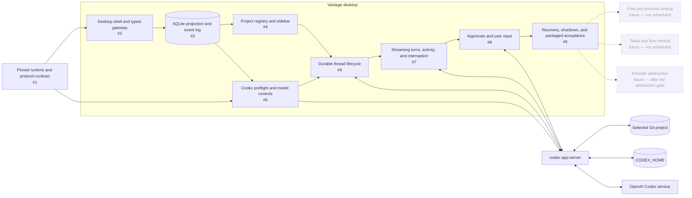

# Milestone 1: Codex chat

[GitHub milestone](https://github.com/mabrax/vantage/milestone/1)

This milestone delivers a packaged Deno Desktop experience in which a developer can register a
local Git project and carry on a real, resumable Codex conversation. This document is the shared
orientation view: the GitHub milestone owns the product outcome, issues own implementation slices,
and the [architecture documents](../architecture/README.md) own design detail.

## Map



## Issue map

| Node or concern | Owning issue |
| --- | --- |
| Runtime and native protocol compatibility contract | [#1 — Spike pinned Deno Desktop and Codex app-server compatibility](https://github.com/mabrax/vantage/issues/1) |
| Packaged shell, WebView boundary, typed commands, snapshots, and ordered local stream | [#2 — Bootstrap the packaged Deno Desktop shell and typed host gateway](https://github.com/mabrax/vantage/issues/2) |
| Durable Vantage state, projection transactions, and application event sequence | [#3 — Implement the SQLite persistence worker and ordered application event log](https://github.com/mabrax/vantage/issues/3) |
| Validated local project registration and sidebar navigation | [#4 — Build persistent project registration and sidebar navigation](https://github.com/mabrax/vantage/issues/4) |
| Codex availability, account state, catalog, and model/runtime controls | [#5 — Implement Codex preflight, account state, and model controls](https://github.com/mabrax/vantage/issues/5) |
| Vantage/native thread identity and disposable live-session lifecycle | [#6 — Implement durable project-scoped Codex thread lifecycle](https://github.com/mabrax/vantage/issues/6) |
| Turn submission, ordered projection, truthful activity, and interruption | [#7 — Implement text turns, streaming chat, activity projection, and interruption](https://github.com/mabrax/vantage/issues/7) |
| Connection-owned approvals and structured user-input requests | [#8 — Implement Codex approvals and structured user-input requests](https://github.com/mabrax/vantage/issues/8) |
| Restart reconciliation, bounded cleanup, operational limits, and exit proof | [#9 — Complete restart recovery, shutdown cleanup, and packaged vertical-slice acceptance](https://github.com/mabrax/vantage/issues/9) |
| Standalone files and terminal workspace | Future vertical — not scheduled |
| Tasks and interactive flow view | Future vertical — not scheduled |
| Provider comparison and possible abstraction | Future architecture discussion — only after the abstraction gate |

## Sequencing

```text
#1 contract spike
 └─> #2 desktop shell
      └─> #3 persistence and event log
           ├─> #4 project registry ─┐
           └─> #5 Codex catalog ───┴─> #6 thread lifecycle
                                           └─> #7 turns and activity
                                                └─> #8 blocking requests
                                                     └─> #9 hardening and exit
```

Issue #1 freezes the runtime and native protocol contract. After #3, project registration (#4) and
Codex catalog/model controls (#5) can proceed in parallel. Issue #9 is the milestone exit issue and
waits for every product path through its dependency chain.

## Invariants

- The WebView never receives Codex credentials, launches child processes, or speaks the native
  app-server protocol.
- A Vantage thread remains bound to one registered project and one compatible `CODEX_HOME`
  continuation domain.
- The native Codex thread ID is the conversation resume identity; Vantage never reconstructs a
  native conversation by replaying its UI projection.
- Native message order is preserved through durable projection, and non-coalescible lifecycle
  activity is never silently dropped.
- Only one turn may be active per thread, and uncertain submission is never replayed automatically.
- Pending approvals and user-input requests belong to the live connection that created them and can
  be settled at most once.
- Local paths and provider output remain untrusted input at every boundary.
- Provider-neutral abstractions, standalone file or terminal surfaces, tasks, and flow views do not
  enter this milestone.

## After this milestone

The next architecture conversation selects the second product vertical from evidence recorded by
the packaged Codex chat slice. Files and terminals, tasks and flow, and a future provider comparison
remain candidates rather than commitments; nothing in this milestone implements them or introduces
a speculative provider abstraction.
