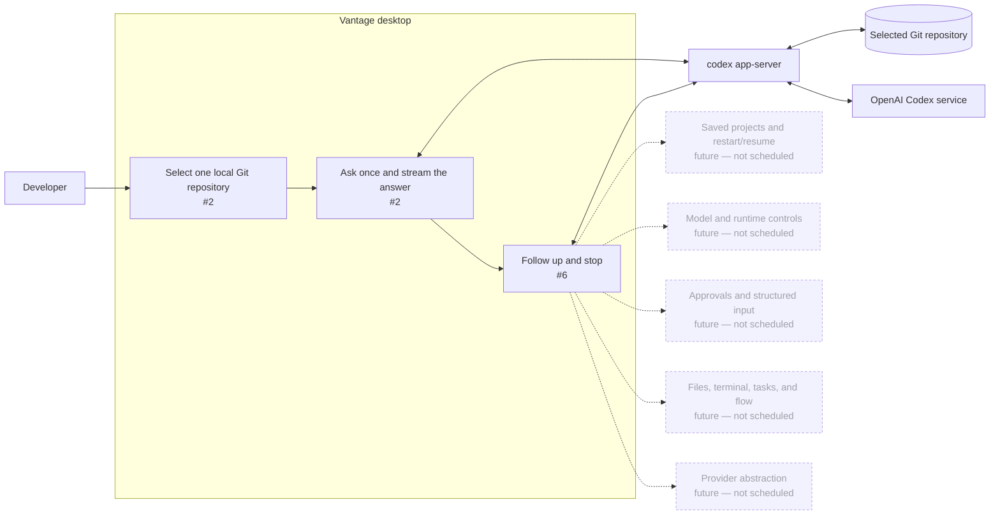

# Milestone 1: Codex chat

[GitHub milestone](https://github.com/mabrax/vantage/milestone/1)

This milestone delivers a packaged Vantage app in which a developer can point at one local Git
repository and hold a real, read-only Codex conversation during the open app session. This document
is the shared orientation view: the GitHub milestone owns the product outcome, issues own
implementation slices, and the [architecture documents](../architecture/README.md) own design
detail.

## Map



## Issue map

| Node or concern | Owning issue |
| --- | --- |
| Packaged window, one validated repository, one real prompt, and streamed answer | [#2 — Ask Codex about one local repository in Vantage](https://github.com/mabrax/vantage/issues/2) |
| Same-session follow-up, visible transcript, and stop | [#6 — Continue and stop the Codex conversation in the open app](https://github.com/mabrax/vantage/issues/6) |
| Saved projects, threads, and restart/resume | Future vertical — not scheduled |
| Model, reasoning, profile, and runtime controls | Future vertical — not scheduled |
| Approvals, structured input, and write-enabled work | Future vertical — not scheduled |
| Rich tool activity, files, terminal, tasks, and flow | Future vertical — not scheduled |
| Provider comparison or abstraction | Future architecture discussion — not scheduled |

## Sequencing

```text
#2 first useful repository-scoped Codex turn
 └─> #6 same-session conversation and stop
```

Issue #2 collapses the minimum desktop, repository, Codex, UI, and acceptance path because none of
those pieces has independent user value. Issue #6 waits for that path, then adds the smallest
capability that turns a one-shot answer into a controllable conversation.

## Invariants

- Every issue ends in a packaged, consumer-visible demonstration; infrastructure is never a
  standalone deliverable.
- The milestone supports one selected local Git repository and one native Codex thread per open app
  session.
- Codex runs read-only for this milestone; Vantage does not expose approval or mutation paths.
- The WebView never receives Codex credentials or launches privileged processes.
- Only one turn is active at a time, and uncertain input is never submitted twice automatically.
- Closing Vantage intentionally discards the conversation and terminates its native process.
- The implementation validates only the native requests and events required by this conversation;
  it does not generate or certify the complete Codex protocol.
- Tests are limited to the behavioral checks needed to prove the packaged conversation and protect
  repository scoping, duplicate submission, and process cleanup.

## Budget and kill criterion

The vertical is capped at five focused implementation days: three for #2 and two for #6. If a
packaged app cannot complete one real, read-only, repository-scoped Codex turn by the end of day two,
stop and re-evaluate the desktop/runtime path. Do not use the remaining budget to build additional
layers, proof publishers, or compatibility machinery.

## After this milestone

The next product conversation asks whether real use of this session-only chat justifies a durable
project and thread-resume vertical. Persistence, sidebars, model controls, blocking interactions,
rich activity, other workspace surfaces, and provider abstraction remain unscheduled; nothing in
this milestone implements them.
