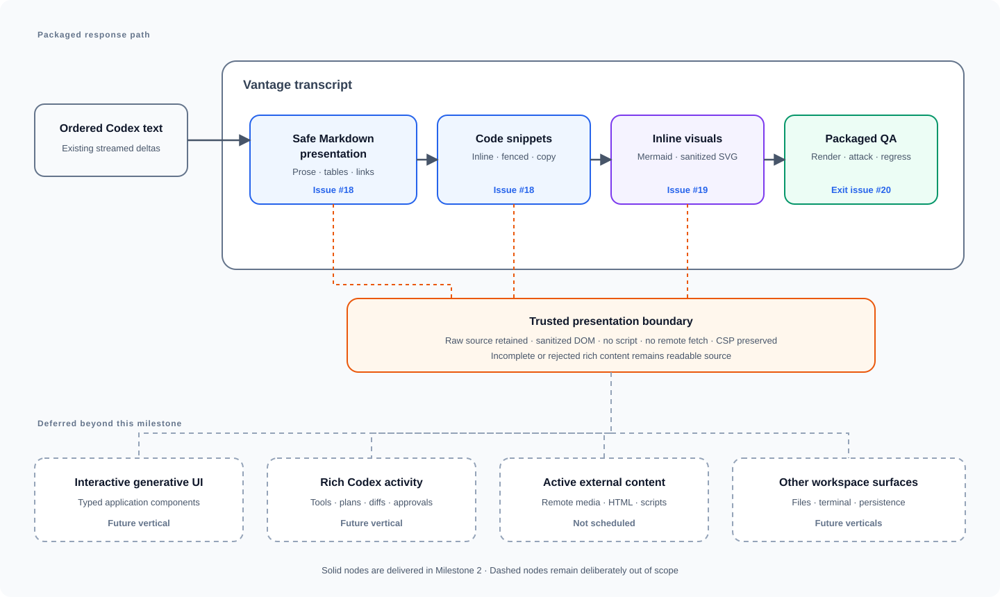

# Milestone 2: Rich Markdown responses

[GitHub milestone](https://github.com/mabrax/vantage/milestone/2)

This milestone delivers a packaged Vantage app in which streamed Codex answers read as safe,
well-formed Markdown with useful code snippets and completed Mermaid or SVG blocks rendered inline.
This document is the shared orientation view: the GitHub milestone owns the product outcome, issues
own implementation slices, and the [architecture documents](../architecture/README.md) own design
detail.

## Map

## Issue map

| Node or concern | Owning issue |
| --- | --- |
| Safe streamed Markdown, tables, links, and code-snippet presentation | [#18 — Render streamed Codex answers as safe Markdown and code](https://github.com/mabrax/vantage/issues/18) |
| Completed Mermaid and sanitized SVG blocks rendered inline | [#19 — Render Mermaid and SVG blocks inline in Codex answers](https://github.com/mabrax/vantage/issues/19) |
| Automated adversarial validation, packaged manual QA, defect repair, and exit evidence | [#20 — QA rich Markdown responses end to end](https://github.com/mabrax/vantage/issues/20) |
| Interactive generative UI components and application-specific widgets | Future vertical — not scheduled |
| Rich Codex tool, plan, diff, usage, and approval activity | Future vertical — not scheduled |
| Remote media, arbitrary HTML, scripts, and embedded web content | Not scheduled |
| File navigation, editing, terminal, persistence, and restart/resume | Future verticals — not scheduled |

## Sequencing

1. Issue #18 defines and delivers the trusted streamed Markdown and code presentation boundary.
2. Issue #19 builds completed Mermaid and SVG visual blocks on that boundary.
3. Issue #20 exercises the packaged renderer, adversarial content, streaming behavior, and
   Milestone 1 regression path.

The base renderer lands first because every richer response type depends on one safe source-to-DOM
contract. Diagram rendering waits for complete fenced input and reuses that contract rather than
introducing a second transcript path. Exit QA fixes and retests in-scope defects before the
milestone closes.

## Invariants

- Provider output remains untrusted data; Markdown, Mermaid, and SVG never execute arbitrary HTML,
  script, event handlers, or embedded active content.
- Rendering does not fetch remote resources or weaken the WebView's no-network content security
  boundary.
- The ordered raw assistant source remains the transcript truth; presentation never changes native
  turn acceptance, delta ordering, interruption, or terminal outcomes.
- User prompts remain literal text and are never interpreted as markup.
- Incomplete or malformed streamed constructs stay readable and cannot erase, reorder, or replace
  prior transcript content.
- Mermaid and SVG become visual only after their closing fence arrives; invalid or rejected visuals
  retain a readable source fallback.
- Code, tables, and visuals remain usable without horizontal page overflow and expose accessible
  labels or source fallbacks.
- The selected repository, one-thread conversation, read-only Codex policy, stop behavior, and
  process cleanup proven in Milestone 1 remain unchanged.
- The milestone closes only after the exit issue records passing automated and computer-controlled
  packaged QA; failed or user-blocked required cases keep it open.

## Budget and kill criterion

The vertical is capped at three focused implementation days: two for the safe Markdown/code
boundary and one for Mermaid/SVG visuals. If the packaged app cannot render a representative
streamed Markdown response without weakening the CSP or accepting executable markup by the end of
day one, stop and re-evaluate the renderer boundary instead of adding more response types. The exit
issue is the gate rather than a new feature allocation; any defect repair still counts against the
three-day cap.

## After this milestone

The next product conversation can define typed, interactive generative UI blocks that Vantage
renders from explicit application contracts rather than arbitrary model-supplied HTML. Rich Codex
activity, file and terminal surfaces, persistence, project/thread navigation, and provider
abstraction remain separate future verticals; nothing in this milestone implements them.
