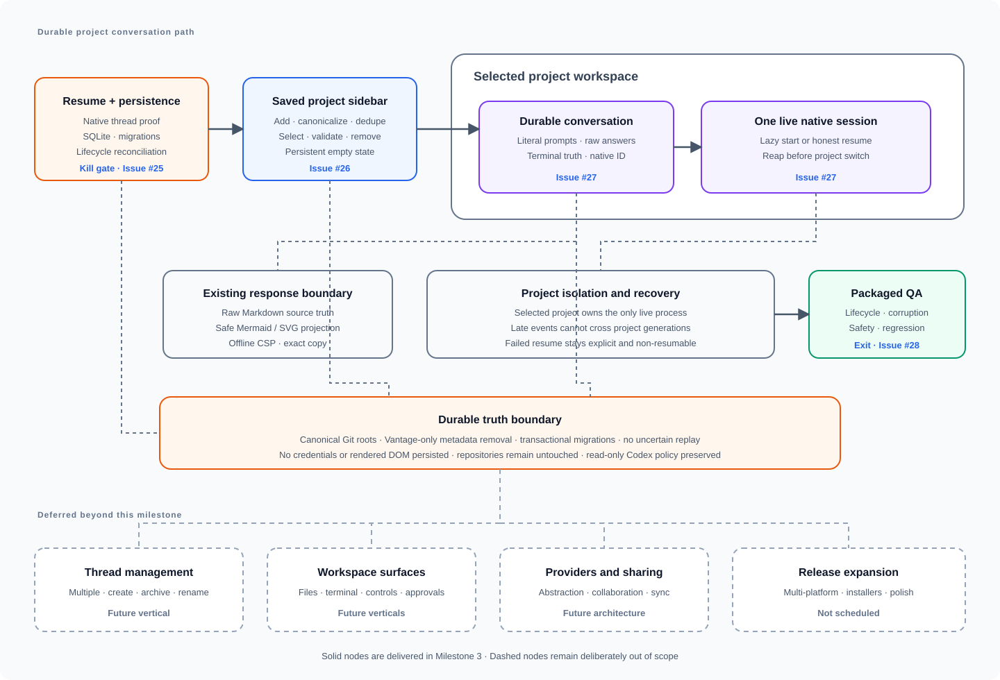

# Milestone 3: Saved projects and conversations

[GitHub milestone](https://github.com/mabrax/vantage/milestone/3)

This milestone delivers a packaged Vantage app in which a developer can register several local Git
repositories in a persistent sidebar, switch among them, continue one saved native Codex
conversation per project after switching or relaunching, and safely forget a project without
touching its repository. This document is the shared orientation view: the GitHub milestone owns
the product outcome, issues own implementation slices, and the
[architecture documents](../architecture/README.md) own design detail.

## Map

## Issue map

| Node or concern | Owning issue |
| --- | --- |
| Durable native resume proof, transactional local storage, migrations, lifecycle truth, and reconciliation contract | [#25 — Prove durable native resume and establish saved conversation foundations](https://github.com/mabrax/vantage/issues/25) |
| Persistent project registry, sidebar, validation, selection, removal, and empty state | [#26 — Add the saved project registry and sidebar](https://github.com/mabrax/vantage/issues/26) |
| One durable conversation per project, isolated switching, relaunch restore, and honest native resume | [#27 — Persist and resume each project's Codex conversation](https://github.com/mabrax/vantage/issues/27) |
| Adversarial validation, packaged computer-controlled QA, defect repair, and milestone exit evidence | [#28 — QA saved projects and conversations end to end](https://github.com/mabrax/vantage/issues/28) |
| Multiple conversations, thread management, and a global activity feed | Future vertical — not scheduled |
| Files, terminals, model controls, approvals, and write-enabled policies | Future verticals — not scheduled |
| Provider abstraction, collaboration, synchronization, and release polish | Future architecture discussions — not scheduled |

## Sequencing

1. Issue #25 is the kill gate. It proves durable native thread resume across a process boundary
   under the fixed read-only policy, establishes the transactional SQLite boundary, and freezes the
   storage, lifecycle, recovery, reconciliation, and removal contracts in architecture documents.
2. Issue #26 waits for that contract, then delivers the persistent multi-project registry and
   sidebar, including canonical identity, actionable unavailable-project states, safe removal, and
   fresh re-add behavior.
3. Issue #27 waits for the registry and foundation, then attaches one saved conversation to each
   project, enforces single-live-session ownership during switching, and restores only honestly
   resumable native context after relaunch.
4. Issue #28 waits for the complete product path, exercises corruption and lifecycle boundaries,
   repairs in-scope defects, and records automated plus computer-controlled packaged evidence.

No downstream issue begins unless the resume proof in issue #25 passes. The registry is
deliberately sequenced after that proof so the milestone does not build navigation polish around a
transcript-only imitation of native continuity.

## Invariants

- A registered project is one validated, canonical, accessible local Git root; duplicate paths and
  symlink aliases never create separate project identities.
- Vantage owns only its registration, conversation projection, native-thread mapping, and
  preferences. It never deletes, moves, mutates, cleans, resets, or otherwise modifies a registered
  Git repository.
- Several projects may be registered, but only the selected project may own the one live
  Vantage-launched app-server process and native session.
- Project switching reaps the prior live process before the next one starts. Late native events,
  deltas, terminal outcomes, process handles, and thread IDs cannot cross project boundaries.
- A conversation displayed as resumable corresponds to the exact native thread that Vantage
  successfully resumed. A missing, incompatible, or failed native thread is explicit and
  non-resumable; saved transcript presentation never impersonates native context.
- Literal user prompts, ordered raw assistant source, native thread identity, and native terminal
  truth are durable. Rendered HTML, DOM, executable markup, credentials, tokens, and environment
  secrets are not.
- Saved assistant source is re-rendered through the existing safe Markdown, Mermaid, and sanitized
  SVG boundary with the offline CSP unchanged.
- Pending, accepted, interrupted, failed, and completed turns survive restart without automatic
  uncertain replay, false completion, duplicate prompts, reordered deltas, or cross-project
  append.
- SQLite migrations are deterministic, transactional, local, and recoverable, and one
  Vantage-owned worker controls the connection.
- Removing a project requires explicit confirmation, reaps any selected live process, forgets only
  Vantage-owned metadata, and does not claim to delete the Codex-owned native thread unless the
  current native API explicitly does so.
- Re-adding a removed path creates a fresh Vantage registration and conversation; removed Vantage
  metadata is not silently resurrected.
- Milestones 1 and 2 remain green: one active turn, ordered native acceptance/deltas/terminal truth,
  Stop and retry behavior, safe rich rendering, exact copying, read-only policy, packaging,
  codesign, and exact Vantage-owned process cleanup.
- The milestone closes only after the exit issue records passing automated and
  computer-controlled packaged QA; failed or genuinely user-blocked required cases keep it open.

## Budget and kill criterion

The vertical is capped at eight focused implementation days: two for the resume and persistence
foundation, two for the saved-project surface, and four for durable conversation integration.
The exit issue is the gate rather than a new feature allocation; defect repair still counts against
the eight-day cap.

Native resume is the first-day kill gate. A fresh app-server process must resume an exact
non-ephemeral native thread created by a prior process and answer a context-dependent follow-up
under the fixed read-only policy. If that proof fails safely or cannot be reconciled honestly, stop
the milestone before building the sidebar and re-evaluate the vertical boundary. Transcript-only
display must not be presented as continued native context.

## After this milestone

The next product conversation can define multiple conversations per project and thread-management
surfaces such as create, archive, rename, history, and global activity. Files, terminals, model
controls, approvals, write-enabled policies, provider abstraction, collaboration, synchronization,
and release polish remain separate future verticals; nothing in this milestone implements them.
